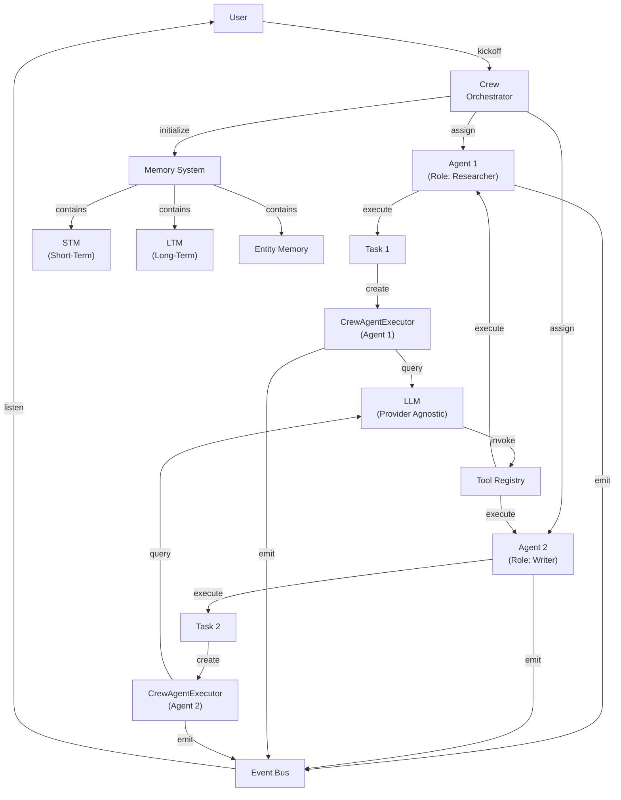
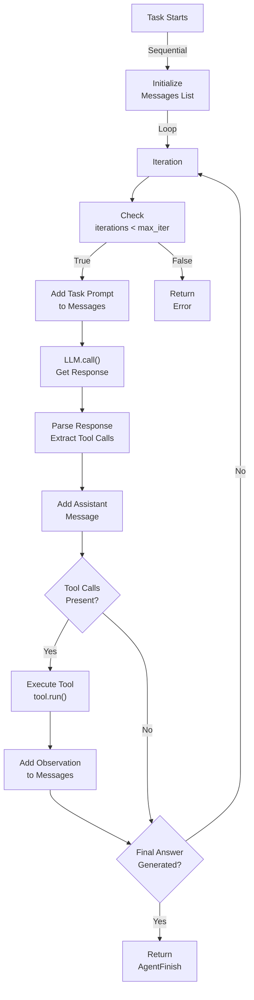
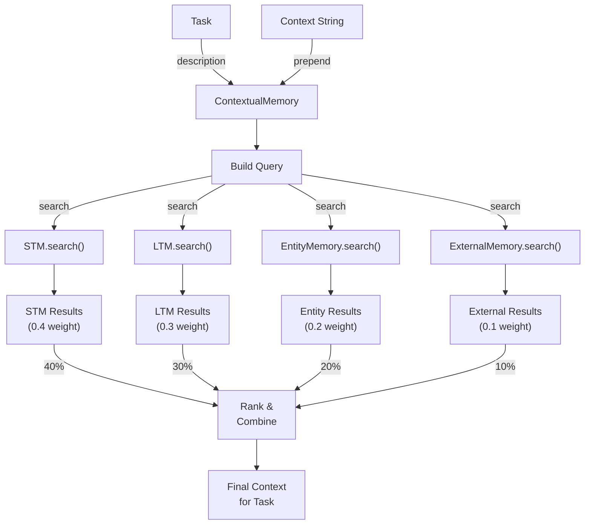
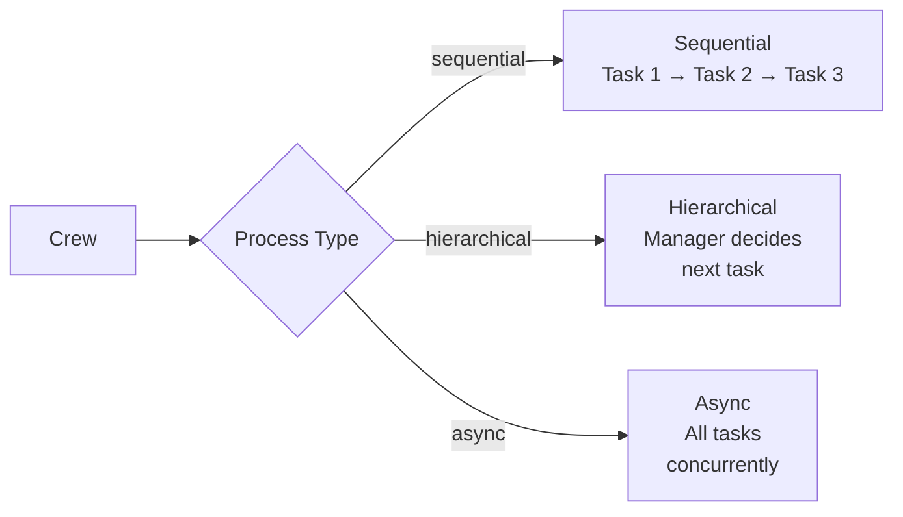

# CrewAI Architecture Deep-Dive

## Table of Contents
1. [Architecture Overview](#architecture-overview)
2. [Core Components & Abstractions](#core-components--abstractions)
3. [Execution Lifecycle Walkthrough](#execution-lifecycle-walkthrough)
4. [Detailed Code Flow Examples](#detailed-code-flow-examples)
5. [Key Design Patterns](#key-design-patterns)
6. [Tool Integration Mechanism](#tool-integration-mechanism)
7. [State Management Deep-Dive](#state-management-deep-dive)
8. [Memory Architecture](#memory-architecture)
9. [Error Handling & Reliability](#error-handling--reliability)
10. [Performance Considerations](#performance-considerations)
11. [Extensibility & Plugin Architecture](#extensibility--plugin-architecture)
12. [Security & Sandboxing](#security--sandboxing)
13. [Trade-Offs & Architectural Decisions](#trade-offs--architectural-decisions)
14. [Critical Files Reference](#critical-files-reference)
15. [Mermaid Diagrams](#mermaid-diagrams)
16. [Code Snippets & Examples](#code-snippets--examples)
17. [Comparison to Other SDKs](#comparison-to-other-sdks)
18. [Further Reading](#further-reading)

---

## Architecture Overview

### Mental Model: Manager Overseeing Employees

CrewAI implements an **imperative multi-agent orchestration** architecture based on a Manager/Employee pattern. Unlike functional or graph-based frameworks, CrewAI uses a hierarchical, explicitly sequential execution model where:

- **Crew** acts as the manager coordinating multiple agents
- **Agents** are employees with specialized roles, goals, and backstories
- **Tasks** are work items assigned to agents
- **Crew orchestration** follows processes (sequential, hierarchical, async)

### Philosophy & Design Principles

1. **Imperative Over Declarative**: Control flow is explicit. You define sequences, conditions, and dependencies programmatically.

2. **Role-Based Agent Design**: Agents are defined by role, goal, and backstory - creating personality-driven AI assistants with clear objectives.

3. **Task-Driven Execution**: Work is decomposed into discrete tasks with clear expected outputs and guardrails.

4. **Multi-Layer Memory**: Four types of memory (STM, LTM, Entity, External) enable learning and context awareness across executions.

5. **Event-Driven Observability**: Every action emits events, enabling comprehensive monitoring and custom callbacks.

6. **Tool-Centric Capability**: Agents gain capabilities through tools (functions, APIs, MCP servers). Tool execution is tracked, cached, and validated.

### Execution Model: ReAct Loop with Extensions

CrewAI implements the **ReAct (Reasoning + Acting) pattern** at its core:

```
Thought → Action → Observation → Reflection → (Loop or Finish)
```

The agent reasons about the task, selects a tool to invoke, observes the result, and reflects before continuing. This cycle repeats until the task is complete or max iterations reached.

---

## Core Components & Abstractions

### 1. Agent (Core Unit of Execution)

**File**: `/Users/bharatbvs/Desktop/ai-agent-repo/crewAI/lib/crewai/src/crewai/agent/core.py` (2,146 lines)

An `Agent` is a specialized AI assistant with defined role, objective, and capabilities.

```python
class Agent(BaseAgent):
    """Core agent class representing an AI employee."""

    # Identity & Purpose
    role: str                           # Agent's role (e.g., "Researcher")
    goal: str                           # Agent's objective
    backstory: str                      # Agent's context and personality

    # Capabilities & Configuration
    llm: BaseLLM                        # Language model instance
    tools: list[BaseTool]               # Available tools
    allow_delegation: bool = False      # Can delegate to other agents
    multimodal: bool = False            # Support for multimodal inputs

    # Execution Parameters
    max_iter: int = 15                  # Max iterations per task
    max_execution_time: float | None    # Timeout in seconds
    max_rpm: int | None = None          # Rate limit (requests/min)

    # Knowledge & Integration
    knowledge_sources: list[str]        # Knowledge bases to query
    apps: list[PlatformAppOrAction]    # CrewAI Platform apps
    mcps: list[str | MCPServerConfig]   # MCP servers

    # Caching & Performance
    cache: bool = True                  # Enable tool result caching
    function_calling_llm: BaseLLM | None  # Override for tool calling
```

**Key Methods**:

- `execute_task(task: Task, context: str | None, tools: list[BaseTool])` - Execute a single task
- `kickoff(task: Task, context: str)` - Synchronous task execution
- `kickoff_async(task: Task, context: str)` - Asynchronous execution
- `create_agent_executor(tools: list[BaseTool])` - Create executor engine
- `get_delegation_tools(agents: list[Agent])` - Tools to delegate to other agents
- `get_platform_tools(apps: list[PlatformAppOrAction])` - CrewAI Platform integration tools
- `get_mcp_tools(mcps: list[str | MCPServerConfig])` - Model Context Protocol tools

### 2. Crew (Multi-Agent Orchestrator)

**File**: `/Users/bharatbvs/Desktop/ai-agent-repo/crewAI/lib/crewai/src/crewai/crew.py` (2,039 lines)

A `Crew` orchestrates multiple agents working on related tasks.

```python
class Crew(FlowTrackable, BaseModel):
    """Orchestrates a group of agents collaborating on tasks."""

    # Core Configuration
    tasks: list[Task]                   # Tasks to execute
    agents: list[Agent]                 # Team members
    process: CrewProcessType            # Execution strategy

    # Memory & Learning
    memory: bool = True                 # Enable crew memory
    short_term_memory: ShortTermMemory | None
    long_term_memory: LongTermMemory | None
    entity_memory: EntityMemory | None
    external_memory: ExternalMemory | None

    # Execution Configuration
    manager_llm: BaseLLM | None         # For hierarchical process
    manager_agent: BaseAgent | None     # Custom manager
    cache: bool = True                  # Tool result caching
    max_rpm: int | None = None          # Rate limiting

    # Advanced Features
    planning: bool = False              # Enable crew planning
    planning_llm: BaseLLM | None        # Planner LLM
    stream: bool = False                # Enable output streaming
    function_calling_llm: BaseLLM | None  # Override tool LLM
```

**Execution Processes**:
- `sequential`: Tasks execute one after another
- `hierarchical`: Manager agent decides next task
- `async`: Multiple tasks execute concurrently

### 3. Task (Unit of Work)

**File**: `/Users/bharatbvs/Desktop/ai-agent-repo/crewAI/lib/crewai/src/crewai/task.py` (1,257 lines)

A `Task` is a discrete unit of work assigned to an agent.

```python
class Task(BaseModel):
    """Represents a task to be executed by an agent."""

    # Definition
    description: str                    # Task description
    expected_output: str                # Clear output expectations

    # Assignment & Execution
    agent: BaseAgent                    # Responsible agent
    context: list[Task] = []            # Prerequisite tasks
    async_execution: bool = False       # Execute asynchronously

    # Output Configuration
    output_file: str | None             # Save output to file
    output_json: type[BaseModel] | None # JSON schema
    output_pydantic: type[BaseModel] | None  # Pydantic schema
    response_model: type[BaseModel] | None   # Structured output

    # Tool & Execution Control
    tools: list[BaseTool] | None = None     # Task-specific tools

    # Validation & Quality
    guardrail: Callable | None          # Validation function
    guardrails: list[Callable] = []     # Validation list
    guardrail_max_retries: int = 2      # Retry on validation failure

    # Workflow & Feedback
    human_input: bool = False           # Require human review
    callback: Callable | None           # Post-execution callback
    markdown: bool = False              # Format as Markdown
```

### 4. CrewAgentExecutor (Execution Engine)

**File**: `/Users/bharatbvs/Desktop/ai-agent-repo/crewAI/lib/crewai/src/crewai/agents/crew_agent_executor.py` (1,430 lines)

The `CrewAgentExecutor` is the core execution engine implementing the ReAct loop.

```python
class CrewAgentExecutor(CrewAgentExecutorMixin):
    """Manages agent execution lifecycle."""

    # Configuration
    llm: BaseLLM                        # Language model
    task: Task                          # Current task
    crew: Crew                          # Parent crew
    agent: Agent                        # Executing agent

    # Tools & Actions
    tools: list[CrewStructuredTool]     # Available tools
    tools_handler: ToolsHandler         # Tool executor

    # Execution State
    messages: list[LLMMessage] = []     # Message history
    iterations: int = 0                 # Current iteration
    max_iter: int = 15                  # Max iterations

    # Advanced Features
    response_model: type[BaseModel] | None  # Structured output
    function_calling_llm: BaseLLM | None    # Tool LLM override
    respect_context_window: bool = False    # Token limit handling
```

**Key Methods**:
- `invoke()` - Main execution entry point
- `_invoke_loop()` - Standard ReAct implementation
- `_invoke_loop_react()` - Enhanced ReAct
- `_invoke_loop_native_tools()` - Native tool calling
- `_handle_tool_call()` - Execute single tool

### 5. LLM Integration (Multiple Providers)

**File**: `/Users/bharatbvs/Desktop/ai-agent-repo/crewAI/lib/crewai/src/crewai/llm.py` (2,350 lines)

CrewAI supports 50+ models across multiple providers via factory pattern.

```python
class LLM(BaseLLM):
    """Factory LLM class for provider-agnostic model access."""

    def __new__(cls, model: str, is_litellm: bool = False, **kwargs):
        """Dynamically instantiate provider-specific LLM classes."""
        # Returns: OpenAIProvider, AnthropicProvider, AzureProvider, etc.
```

**Supported Providers**:
- OpenAI (gpt-4, gpt-4-turbo, gpt-3.5-turbo)
- Anthropic (claude-3-opus, claude-3-sonnet)
- Azure OpenAI
- Google Gemini
- AWS Bedrock
- Custom via LiteLLM

### 6. Tool Framework

**File**: `/Users/bharatbvs/Desktop/ai-agent-repo/crewAI/lib/crewai/src/crewai/tools/base_tool.py` (555 lines)

Tools provide agent capabilities through a standardized interface.

```python
class BaseTool(BaseModel, ABC):
    """Abstract base for all tools."""

    # Identity
    name: str                           # Tool name (e.g., "search_web")
    description: str                    # Usage description

    # Execution Control
    args_schema: type[BaseModel]        # Argument schema (Pydantic)
    cache_function: Callable | None     # Custom caching logic
    result_as_answer: bool = False      # Treat result as final

    # Usage Limits
    max_usage_count: int | None = None  # Max invocations
    current_usage_count: int = 0        # Current count

    # Validation
    env_vars: list[str] = []            # Required env vars

    @abstractmethod
    def _run(self, *args, **kwargs) -> Any:
        """Tool implementation."""
        pass

    def run(self, *args, **kwargs) -> Any:
        """Execute tool with caching, usage tracking, validation."""
        pass
```

---

## Execution Lifecycle Walkthrough

### End-to-End Task Execution Flow

```
1. crew.kickoff() called
   ├─ Input: tasks and initial context

2. Validation Phase
   ├─ validate_tasks() - check task definitions
   ├─ validate_async_tasks_not_async() - async consistency
   └─ validate_context_no_future_tasks() - dependency ordering

3. Memory Initialization
   ├─ create_crew_memory() - initialize STM, LTM, Entity, External
   └─ create_crew_knowledge() - load knowledge retrieval

4. Process Selection
   ├─ Sequential: tasks execute one after another
   ├─ Hierarchical: manager agent decides sequence
   └─ Async: multiple tasks run concurrently

5. Task Execution Loop (for each task)
   ├─ _execute_tasks()
   │  ├─ agent.execute_task(task)
   │  │  ├─ _prepare_kickoff() - build context
   │  │  │  ├─ ContextualMemory.build_context_for_task()
   │  │  │  │  ├─ _fetch_stm_context() - short-term memory
   │  │  │  │  ├─ _fetch_ltm_context() - long-term memory
   │  │  │  │  ├─ _fetch_entity_context() - entity relationships
   │  │  │  │  └─ _fetch_external_context() - external systems
   │  │  │  └─ Aggregate all context
   │  │  │
   │  │  ├─ create_agent_executor()
   │  │  │  └─ CrewAgentExecutor(llm, task, crew, agent, tools, ...)
   │  │  │
   │  │  ├─ agent_executor.invoke()
   │  │  │  └─ ReAct Loop (iterations)
   │  │  │     ├─ llm.call(messages, tools) → LLM response
   │  │  │     ├─ Parse response → extract tool calls
   │  │  │     ├─ For each tool call:
   │  │  │     │  ├─ Check cache
   │  │  │     │  ├─ Execute tool
   │  │  │     │  ├─ Emit events
   │  │  │     │  └─ Add observation to messages
   │  │  │     └─ Check termination: task complete?
   │  │  │
   │  │  ├─ _process_guardrail() - validate output
   │  │  │  ├─ run_guardrail_validators()
   │  │  │  └─ retry on failure (max_retries)
   │  │  │
   │  │  └─ _process_task_result()
   │  │     ├─ Save to output_file (if specified)
   │  │     ├─ Convert to output_json/output_pydantic
   │  │     ├─ Emit TaskCompletedEvent
   │  │     └─ Return TaskOutput
   │  │
   │  └─ Update context for next task (append to task.context)
   │
   ├─ Handle Conditional Tasks
   │  ├─ if task has conditional function
   │  └─ conditionally execute next task
   │
   └─ Collect all task outputs → CrewOutput

6. Post-Execution
   ├─ after_kickoff_callbacks() - execute callbacks
   └─ return CrewOutput (all task results)
```

### Detailed Execution Call Stack

**File References & Line Numbers**:

1. **Crew.kickoff()** (line 695)
   - Validates all tasks
   - Initializes memory systems
   - Calls appropriate process execution

2. **Crew._run_sequential_process()** (line 1148)
   - Simple loop through tasks
   - Each task executed in order
   - Context from previous task passed to next

3. **Crew._execute_tasks()** (line 1184)
   - Core task execution loop
   - Handles task dependencies
   - Manages task outputs

4. **Agent.execute_task()** (line 336)
   - Prepares task context
   - Creates agent executor
   - Invokes executor loop

5. **Agent._prepare_kickoff()** (not shown but implied)
   - Builds memory context via ContextualMemory
   - Retrieves relevant information from STM, LTM, entities

6. **CrewAgentExecutor.invoke()** (line 173)
   - Calls appropriate invoke loop
   - Handles different execution strategies

7. **CrewAgentExecutor._invoke_loop()** (line 281)
   - Standard ReAct loop
   - Alternates: LLM call → Tool execution → observation

8. **LLM.call()** (line 1624)
   - Formats messages for provider
   - Makes API call
   - Parses response

9. **CrewAgentExecutor._handle_tool_call()** (line 1535)
   - Validates tool call format
   - Executes tool
   - Captures result as observation

---

## Detailed Code Flow Examples

### Example 1: Simple Task Execution

```python
from crewai import Agent, Task, Crew
from crewai.tools import tool

@tool
def search_web(query: str) -> str:
    """Search the web for information."""
    return f"Results for: {query}"

# Create specialized agent
researcher = Agent(
    role="Researcher",
    goal="Find accurate information",
    backstory="Expert researcher with 10 years experience",
    tools=[search_web],
    llm=llm  # LLM instance
)

# Define task
research_task = Task(
    description="Research the latest AI advancements",
    expected_output="Comprehensive summary of recent AI breakthroughs",
    agent=researcher
)

# Execute via crew
crew = Crew(
    agents=[researcher],
    tasks=[research_task]
)

output = crew.kickoff()
# Output contains: research_task_result, used_tools, raw_output
```

**Execution Trace**:
1. `crew.kickoff()` → Crew.kickoff() line 695
2. Task validation → Crew.validate_tasks() line 1125
3. Memory init → Crew.create_crew_memory() line 1070
4. Task execution → Crew._execute_tasks() line 1184
5. Agent execution → Agent.execute_task() line 336
6. Context building → ContextualMemory.build_context_for_task()
7. Executor creation → Agent.create_agent_executor() line 773
8. Executor invocation → CrewAgentExecutor.invoke() line 173
9. ReAct loop → CrewAgentExecutor._invoke_loop() line 281
10. Tool execution → Tool.run() line [tool_definition]

### Example 2: Multi-Agent Crew with Task Delegation

```python
from crewai import Agent, Task, Crew
from crewai.tools import tool

@tool
def write_content(topic: str) -> str:
    """Write content about a topic."""
    return f"Content about {topic}..."

@tool
def research_topic(topic: str) -> str:
    """Research a topic."""
    return f"Research on {topic}..."

# Create research agent
researcher = Agent(
    role="Researcher",
    goal="Gather comprehensive information",
    backstory="Seasoned researcher",
    tools=[research_topic],
    llm=llm
)

# Create writer agent
writer = Agent(
    role="Content Writer",
    goal="Create engaging content",
    backstory="Professional writer",
    tools=[write_content],
    allow_delegation=True,  # Can delegate to researcher
    llm=llm
)

# Task 1: Researcher gathers info
research_task = Task(
    description="Research AI safety",
    expected_output="Detailed research notes",
    agent=researcher
)

# Task 2: Writer uses research context
writing_task = Task(
    description="Write article on AI safety",
    expected_output="Complete article",
    agent=writer,
    context=[research_task]  # Receives researcher output
)

crew = Crew(
    agents=[researcher, writer],
    tasks=[research_task, writing_task],
    process=CrewProcessType.sequential
)

output = crew.kickoff()
# research_task output → writing_task input
```

**Context Flow**:
1. Research task completes → output stored
2. Writing task executes with context=research_task
3. ContextualMemory builds context including research results
4. Writer receives enhanced prompt with research data

### Example 3: Hierarchical Crew with Manager

```python
from crewai import Agent, Task, Crew
from langchain_openai import ChatOpenAI

# Create agents
analyst = Agent(role="Data Analyst", goal="Analyze data", llm=llm)
developer = Agent(role="Developer", goal="Develop solutions", llm=llm)
manager = Agent(role="Manager", goal="Oversee team", llm=llm)

tasks = [
    Task(description="Analyze market trends", agent=analyst),
    Task(description="Develop new feature", agent=developer)
]

crew = Crew(
    agents=[analyst, developer],
    tasks=tasks,
    process=CrewProcessType.hierarchical,
    manager_agent=manager  # Custom manager
)

# Manager decides task sequence dynamically
output = crew.kickoff()
```

**Manager Decision Flow**:
1. Manager receives: current state + all tasks
2. Manager generates: next task recommendation
3. Crew executes: recommended task
4. Loop: steps 1-3 until all tasks complete

---

## Key Design Patterns

### 1. Factory Pattern: LLM Provider Selection

**File**: `/Users/bharatbvs/Desktop/ai-agent-repo/crewAI/lib/crewai/src/crewai/llm.py` (line 150-200)

```python
class LLM(BaseLLM):
    def __new__(cls, model: str, is_litellm: bool = False, **kwargs):
        """Dynamically instantiate correct provider class."""
        if model.startswith("gpt"):
            from .providers.openai_provider import OpenAIProvider
            return OpenAIProvider(model=model, **kwargs)
        elif model.startswith("claude"):
            from .providers.anthropic_provider import AnthropicProvider
            return AnthropicProvider(model=model, **kwargs)
        # ... more providers
        else:
            return LiteLLMProvider(model=model, **kwargs)

# Usage: LLM factory handles provider selection
llm = LLM(model="gpt-4")  # Returns OpenAIProvider instance
llm = LLM(model="claude-3-opus")  # Returns AnthropicProvider instance
```

**Benefits**:
- Single interface for multiple providers
- Transparent provider switching
- Runtime provider selection

### 2. Abstract Factory Pattern: Tool System

**File**: `/Users/bharatbvs/Desktop/ai-agent-repo/crewAI/lib/crewai/src/crewai/tools/base_tool.py` (line 50-150)

```python
class BaseTool(BaseModel, ABC):
    """Abstract factory for tool implementations."""

    @abstractmethod
    def _run(self, *args, **kwargs) -> Any:
        """Implementation by subclass."""
        pass

    def run(self, *args, **kwargs) -> Any:
        """Template method: caching + validation + execution."""
        # Check usage limits
        if self.max_usage_count and self.current_usage_count >= self.max_usage_count:
            raise ToolException("Max usage exceeded")

        # Check cache
        cache_key = self._get_cache_key(*args, **kwargs)
        if cached := self._get_cached_result(cache_key):
            return cached

        # Emit event
        emit_event(ToolUsageStartedEvent(tool_name=self.name))

        # Execute
        try:
            result = self._run(*args, **kwargs)
            self._cache_result(cache_key, result)
            emit_event(ToolUsageFinishedEvent(tool_name=self.name, result=result))
            return result
        except Exception as e:
            emit_event(ToolUsageErrorEvent(tool_name=self.name, error=str(e)))
            raise
```

**Subclasses**:
- `@tool` decorator - function-based tools
- Custom `BaseTool` subclasses
- MCP tool adapters
- Platform app wrappers

### 3. Observer Pattern: Event-Driven Architecture

**File**: `/Users/bharatbvs/Desktop/ai-agent-repo/crewAI/lib/crewai/src/crewai/events/event_bus.py` (line 1-150)

```python
class EventBus:
    """Central pub/sub system."""

    @classmethod
    def subscribe(cls, event_type: type[BaseEvent], handler: Callable):
        """Register event handler."""
        if event_type not in cls._handlers:
            cls._handlers[event_type] = []
        cls._handlers[event_type].append(handler)

    @classmethod
    def emit(cls, source: str, event: BaseEvent, **kwargs):
        """Broadcast event to all subscribers."""
        if event.__class__ in cls._handlers:
            for handler in cls._handlers[event.__class__]:
                handler(event, source=source, **kwargs)

# Usage
def on_tool_used(event: ToolUsageFinishedEvent, **kwargs):
    print(f"Tool {event.tool_name} completed in {event.duration}ms")

crewai_event_bus.subscribe(ToolUsageFinishedEvent, on_tool_used)
```

**Event Types**: 20+ event types covering agent, crew, task, LLM, tool, memory execution

### 4. Strategy Pattern: Execution Strategies

**File**: `/Users/bharatbvs/Desktop/ai-agent-repo/crewAI/lib/crewai/src/crewai/agents/crew_agent_executor.py` (line 280-550)

```python
class CrewAgentExecutor:
    def invoke(self):
        """Select and execute strategy."""
        if self.llm.supports_function_calling:
            return self._invoke_loop_native_tools()
        elif self.llm.supports_stop_words:
            return self._invoke_loop_react()
        else:
            return self._invoke_loop_react()  # Fallback

    def _invoke_loop_native_tools(self):
        """Strategy 1: Use native tool calling."""
        # LLM returns tool calls directly
        # E.g., OpenAI function_calling, Anthropic tool_use
        pass

    def _invoke_loop_react(self):
        """Strategy 2: Parse tool calls from LLM text."""
        # LLM returns text like: "Action: search\nAction Input: query"
        # Parser extracts tool calls
        pass

    def _invoke_loop_native_no_tools(self):
        """Strategy 3: No tool calling, direct response."""
        # LLM generates response without tool calls
        pass
```

**Benefits**:
- Different execution strategies for different LLMs
- Seamless fallback handling
- Optimized for model capabilities

### 5. Dependency Injection: Constructor Injection

**File**: `/Users/bharatbvs/Desktop/ai-agent-repo/crewAI/lib/crewai/src/crewai/agents/crew_agent_executor.py` (line 80-130)

```python
class CrewAgentExecutor:
    def __init__(
        self,
        llm: BaseLLM,                    # Injected LLM
        task: Task,                      # Injected Task
        crew: Crew,                      # Injected Crew
        agent: Agent,                    # Injected Agent
        tools: list[CrewStructuredTool],  # Injected Tools
        tools_handler: ToolsHandler,     # Injected Handler
        # ... more injected dependencies
    ):
        self.llm = llm
        self.task = task
        self.crew = crew
        self.agent = agent
        self.tools = tools
        self.tools_handler = tools_handler
        # All dependencies provided at construction time
```

**Benefits**:
- Testability: mock any dependency
- Flexibility: swap implementations
- Separation of concerns: clear dependencies

---

## Tool Integration Mechanism

### Tool Definition & Registration

**Tool Decorator** (`@tool` decorator):

```python
from crewai.tools import tool

@tool
def search_web(query: str) -> str:
    """Search the web for information.

    Args:
        query: The search query

    Returns:
        Search results
    """
    # Implementation
    return results

# Decorator creates BaseTool with:
# - name: "search_web"
# - description: docstring
# - args_schema: inferred from function signature
# - _run: the function itself
```

### Schema Extraction

**File**: `/Users/bharatbvs/Desktop/ai-agent-repo/crewAI/lib/crewai/src/crewai/tools/base_tool.py` (line 200-250)

```python
def _generate_schema_from_function(func: Callable) -> type[BaseModel]:
    """Convert function signature to Pydantic model."""
    signature = inspect.signature(func)
    fields = {}

    for param_name, param in signature.parameters.items():
        if param_name == 'self':
            continue

        # Extract type annotation
        type_hint = param.annotation

        # Create Pydantic field
        fields[param_name] = (type_hint, Field(..., description=get_doc_description(func, param_name)))

    # Create dynamic Pydantic model
    return create_model(f"{func.__name__}Schema", **fields)
```

### Tool Invocation Flow

```
1. Agent needs to call tool
   ├─ LLM generates tool call
   │  └─ Tool name + arguments

2. CrewAgentExecutor._handle_tool_call()
   ├─ Validate tool call format
   ├─ Find tool in registry by name
   └─ Validate arguments against schema

3. Tool.run(arguments)
   ├─ Check usage limits
   ├─ Check cache
   ├─ Emit ToolUsageStartedEvent
   ├─ Execute _run()
   ├─ Emit ToolUsageFinishedEvent / ToolUsageErrorEvent
   └─ Return result

4. Result added to messages
   └─ Next LLM iteration includes observation
```

### Tool Execution Context

**File**: `/Users/bharatbvs/Desktop/ai-agent-repo/crewAI/lib/crewai/src/crewai/tools/tool_usage.py` (line 1-100)

```python
class ToolUsageTracker:
    """Tracks tool execution metrics."""

    def __init__(self, tool: BaseTool):
        self.tool = tool
        self.executions: list[ToolExecution] = []

    def track_execution(self, args: dict, result: Any, duration: float, error: Exception | None):
        """Record tool execution."""
        execution = ToolExecution(
            tool_name=self.tool.name,
            args=args,
            result=result,
            duration_ms=duration * 1000,
            error=error,
            timestamp=datetime.now()
        )
        self.executions.append(execution)

# Available for telemetry and debugging
tracker = tool_usage_tracker
print(f"Tool used {len(tracker.executions)} times")
print(f"Average duration: {tracker.average_duration()}ms")
print(f"Success rate: {tracker.success_rate():.2%}")
```

### MCP Tool Integration

**File**: `/Users/bharatbvs/Desktop/ai-agent-repo/crewAI/lib/crewai/src/crewai/mcp/client.py` (743 lines)

```python
class MCPClient:
    """Model Context Protocol integration."""

    def __init__(self, server_config: MCPServerConfig):
        self.config = server_config
        self.client = None
        self.tools: list[CrewStructuredTool] = []

    def connect(self):
        """Connect to MCP server."""
        # Initialize connection
        # Discover tools
        # Convert tools to CrewStructuredTool

    def get_tools(self) -> list[CrewStructuredTool]:
        """Get available tools from server."""
        return self.tools

    def invoke_tool(self, tool_name: str, arguments: dict) -> Any:
        """Call tool on remote MCP server."""
        # Send tool call to server
        # Wait for response
        # Return result
```

---

## State Management Deep-Dive

### Message History & Conversation State

**File**: `/Users/bharatbvs/Desktop/ai-agent-repo/crewAI/lib/crewai/src/crewai/agents/crew_agent_executor.py` (line 400-500)

```python
class CrewAgentExecutor:
    def __init__(self, ...):
        self.messages: list[LLMMessage] = []
        self.iterations: int = 0
        self.max_iter: int = 15

    def _invoke_loop(self):
        """ReAct loop with message accumulation."""
        while self.iterations < self.max_iter:
            self.iterations += 1

            # 1. Add current task to messages
            if self.iterations == 1:
                self.messages.append(LLMMessage(
                    role="user",
                    content=self.prompt.render(task=self.task, context=...)
                ))

            # 2. Get LLM response
            response = self.llm.call(
                messages=self.messages,
                tools=self.tools,
                # ... other params
            )

            # 3. Parse tool calls
            tool_calls = self._parse_tool_calls(response.content)

            # 4. Add assistant message
            self.messages.append(LLMMessage(
                role="assistant",
                content=response.content
            ))

            # 5. Execute tools and add observations
            for tool_call in tool_calls:
                result = self._handle_tool_call(tool_call)
                self.messages.append(LLMMessage(
                    role="user",
                    content=f"Tool result: {result}"
                ))

            # 6. Check termination
            if self._is_final_answer(response):
                return AgentFinish(output=response.content)
```

**Message Accumulation Pattern**:
1. User message: Task prompt + context
2. Assistant message: LLM reasoning + tool call
3. User message: Tool observation
4. (Repeat 2-3)
5. Assistant message: Final answer

### Task Output Accumulation

**File**: `/Users/bharatbvs/Desktop/ai-agent-repo/crewAI/lib/crewai/src/crewai/crew.py` (line 1200-1300)

```python
class Crew:
    def _execute_tasks(self):
        """Task execution with output accumulation."""
        task_outputs: list[TaskOutput] = []
        context: str = ""

        for task in self.tasks:
            # Prepare context from previous tasks
            context = self._prepare_context(
                context=context,
                task_outputs=task_outputs,
                task=task
            )

            # Execute task
            task_output = self._execute_task(task, context)

            # Accumulate output
            task_outputs.append(task_output)

            # Update context for next task
            context = self._update_context_from_output(context, task_output)

        return task_outputs  # All results
```

### State Persistence

**File**: `/Users/bharatbvs/Desktop/ai-agent-repo/crewAI/lib/crewai/src/crewai/memory/short_term/short_term_memory.py` (line 150-250)

```python
class ShortTermMemory:
    """Transient state within single crew execution."""

    def save(self, value: Any, metadata: dict | None = None):
        """Save to temporary storage."""
        # Embed value
        embedding = self.embedder.embed(str(value))

        # Store in RAG vector DB
        self.storage.add(
            id=str(uuid4()),
            content=str(value),
            embedding=embedding,
            metadata=metadata or {}
        )

    async def asearch(self, query: str, limit: int = 5) -> list[Any]:
        """Search temporary memory."""
        query_embedding = await self.embedder.aembed(query)
        results = await self.storage.asearch(
            query_embedding=query_embedding,
            limit=limit,
            score_threshold=0.6
        )
        return results
```

**File**: `/Users/bharatbvs/Desktop/ai-agent-repo/crewAI/lib/crewai/src/crewai/memory/long_term/long_term_memory.py` (line 100-200)

```python
class LongTermMemory:
    """Persistent state across crew executions."""

    def save(self, item: LongTermMemoryItem):
        """Save to persistent storage."""
        # Item includes: description, quality_score, task_id, crew_id

        db_item = LongTermMemoryEntry(
            id=str(uuid4()),
            description=item.description,
            quality_score=item.quality_score,
            task_id=item.task_id,
            crew_id=item.crew_id,
            created_at=datetime.now()
        )

        self.storage.save(db_item)  # SQLite persist
```

---

## Memory Architecture

### Four-Tier Memory System

CrewAI implements a sophisticated four-tier memory system for learning and context awareness:

```
┌─────────────────────────────────────────────┐
│        Context Building for Task            │
└─────────────────────────────────────────────┘
              ↓      ↓       ↓       ↓
         STM  LTM  Entity  External
         ↓     ↓      ↓       ↓
┌────────────────────────────────────────────┐
│  ContextualMemory (Aggregator)              │
│  - Fetches from all sources                 │
│  - Ranks by relevance                       │
│  - Combines into task context               │
└────────────────────────────────────────────┘
```

### 1. Short-Term Memory (STM)

**File**: `/Users/bharatbvs/Desktop/ai-agent-repo/crewAI/lib/crewai/src/crewai/memory/short_term/short_term_memory.py` (318 lines)

**Purpose**: Transient storage for current crew execution

**Storage Options**:
- RAGStorage: Vector-based similarity search (default)
- Mem0Storage: Mem0 AI integration

**Lifecycle**: In-memory or process-scoped, cleared after execution

```python
class ShortTermMemory(Memory):
    def __init__(self, crew: Crew, embedder_config: EmbedderConfig | None = None):
        self.crew = crew
        self.embedder_config = embedder_config

        # Initialize storage
        if embedder_config and embedder_config.provider == "mem0":
            self.storage = Mem0Storage(embedder_config)
        else:
            self.storage = RAGStorage(embedder_config)

    def save(self, value: Any, metadata: dict | None = None):
        """Save interaction to STM."""
        # Vectorize and store

    def search(self, query: str, limit: int = 5, score_threshold: float = 0.6):
        """Find similar past interactions."""
        # Vector similarity search
```

### 2. Long-Term Memory (LTM)

**File**: `/Users/bharatbvs/Desktop/ai-agent-repo/crewAI/lib/crewai/src/crewai/memory/long_term/long_term_memory.py` (255 lines)

**Purpose**: Persistent storage across multiple crew executions

**Storage**: SQLite-based

**Lifecycle**: Persists indefinitely (or until manually cleared)

```python
class LongTermMemory(Memory):
    def __init__(self, crew: Crew):
        self.crew = crew
        self.storage = LTMSQLiteStorage(
            db_path=f".crews/{crew.id}/ltm.db"
        )

    def save(self, item: LongTermMemoryItem):
        """Save successful task completion."""
        # item = (task_desc, output, quality_score, ...)

    def recall(self, query: str, limit: int = 3) -> list[LongTermMemoryItem]:
        """Retrieve high-quality past solutions."""
        # SQL query by similarity
```

### 3. Entity Memory

**File**: `/Users/bharatbvs/Desktop/ai-agent-repo/crewAI/lib/crewai/src/crewai/memory/entity/entity_memory.py` (404 lines)

**Purpose**: Track entities (people, organizations, concepts) and relationships

**Features**:
- Entity extraction from interactions
- Relationship graph
- Context enrichment

```python
class EntityMemory(Memory):
    def save_entity(self, entity: Entity, relationships: list[Relationship]):
        """Store entity with relationships."""
        # entity = Entity(name, type, description, metadata)
        # relationships = [(entity, relation_type, target_entity), ...]

    def get_entity_context(self, entity_name: str) -> str:
        """Get all information about entity."""
        # Returns: entity description + relationships + mentions
```

### 4. External Memory

**File**: `/Users/bharatbvs/Desktop/ai-agent-repo/crewAI/lib/crewai/src/crewai/memory/external/external_memory.py` (301 lines)

**Purpose**: Integration with external knowledge systems

**Options**:
- Custom API integrations
- Knowledge graphs
- External databases

```python
class ExternalMemory(Memory):
    def __init__(self, crew: Crew, provider: str, **config):
        self.crew = crew
        self.provider = provider  # Custom provider name
        self.config = config

    def save(self, value: Any, metadata: dict | None = None):
        """Send to external system."""
        # Call external API

    def search(self, query: str, **kwargs) -> list[Any]:
        """Query external knowledge."""
        # Call external API
```

### Contextual Memory Aggregation

**File**: `/Users/bharatbvs/Desktop/ai-agent-repo/crewAI/lib/crewai/src/crewai/memory/contextual/contextual_memory.py` (254 lines)

```python
class ContextualMemory:
    """Aggregates memory from all sources for task context."""

    def build_context_for_task(self, task: Task, context: str = "") -> str:
        """Build rich context from all memory sources."""
        query = f"{task.description} {context}"

        # 1. Query STM (short-term interactions)
        stm_context = self._fetch_stm_context(query, limit=3)

        # 2. Query LTM (high-quality solutions)
        ltm_context = self._fetch_ltm_context(task.description, limit=2)

        # 3. Query Entity Memory
        entity_context = self._fetch_entity_context(query, limit=3)

        # 4. Query External Memory
        external_context = self._fetch_external_context(query, limit=2)

        # Combine with ranking
        all_context = [
            (0.4, stm_context),      # Weight: 40%
            (0.3, ltm_context),      # Weight: 30%
            (0.2, entity_context),   # Weight: 20%
            (0.1, external_context)  # Weight: 10%
        ]

        # Build final context string
        final_context = self._rank_and_combine(all_context)
        return final_context

    async def abuild_context_for_task(self, task: Task, context: str = "") -> str:
        """Async variant."""
        # Same as above but with async/await
```

---

## Error Handling & Reliability

### Error Types

**File**: `/Users/bharatbvs/Desktop/ai-agent-repo/crewAI/lib/crewai/src/crewai/errors.py` (500+ lines)

```python
# Tool Execution Errors
class ToolException(Exception):
    """Tool execution failed."""
    pass

class ToolNotFoundError(ToolException):
    """Tool not found in registry."""
    pass

class ToolValidationError(ToolException):
    """Tool arguments invalid."""
    pass

# Task Execution Errors
class TaskExecutionError(Exception):
    """Task execution failed."""
    pass

class TaskOutputError(TaskExecutionError):
    """Task output validation failed."""
    pass

class GuardrailError(TaskExecutionError):
    """Guardrail validation failed."""
    pass

# Crew Execution Errors
class CrewExecutionError(Exception):
    """Crew execution failed."""
    pass

class TaskDependencyError(CrewExecutionError):
    """Task dependency unmet."""
    pass

# LLM Errors
class LLMError(Exception):
    """LLM call failed."""
    pass

class LLMRateLimitError(LLMError):
    """Rate limit exceeded."""
    pass

class LLMTimeout(LLMError):
    """LLM call timed out."""
    pass
```

### Retry Mechanisms

**File**: `/Users/bharatbvs/Desktop/ai-agent-repo/crewAI/lib/crewai/src/crewai/agents/crew_agent_executor.py` (line 1100-1200)

```python
def _handle_tool_call(self, tool_call: ToolCall) -> str:
    """Execute tool with retry logic."""
    max_retries = 3
    retry_count = 0

    while retry_count < max_retries:
        try:
            # Execute tool
            tool = self.tools_handler.get_tool(tool_call.name)
            result = tool.run(**tool_call.arguments)
            return result

        except ToolException as e:
            retry_count += 1

            if retry_count < max_retries:
                # Backoff before retry
                wait_time = 2 ** retry_count  # Exponential backoff
                time.sleep(wait_time)
                continue
            else:
                # Max retries exceeded
                raise

        except Exception as e:
            # Non-retryable error
            raise ToolException(f"Tool execution failed: {str(e)}")
```

### Guardrail Validation & Recovery

**File**: `/Users/bharatbvs/Desktop/ai-agent-repo/crewAI/lib/crewai/src/crewai/task.py` (line 800-900)

```python
def _process_guardrail(self, output: str, iteration: int) -> tuple[bool, str]:
    """Validate output with guardrails and retry if needed."""
    guardrails_to_check = [self.guardrail] + self.guardrails if self.guardrail else self.guardrails

    for guardrail in guardrails_to_check:
        try:
            # Run guardrail validation
            result = guardrail(output)

            if not result.is_valid:
                # Guardrail failed
                if iteration < self.guardrail_max_retries:
                    # Can retry
                    emit_event(GuardrailFailedEvent(
                        task_id=self.id,
                        guardrail=guardrail.__name__,
                        reason=result.message,
                        iteration=iteration
                    ))
                    return False, result.message  # Signal retry needed
                else:
                    # Max retries exceeded
                    raise GuardrailError(f"Guardrail failed: {result.message}")

        except Exception as e:
            raise GuardrailError(f"Guardrail validation error: {str(e)}")

    # All guardrails passed
    return True, ""
```

### Timeout Handling

**File**: `/Users/bharatbvs/Desktop/ai-agent-repo/crewAI/lib/crewai/src/crewai/agent/core.py` (line 500-600)

```python
def _execute_with_timeout(self, task: Task, context: str) -> str:
    """Execute task with timeout."""
    if not self.max_execution_time:
        return self._execute_without_timeout(task, context)

    def executor():
        return self._execute_without_timeout(task, context)

    # Create thread with timeout
    thread = threading.Thread(target=executor, daemon=False)
    thread.start()
    thread.join(timeout=self.max_execution_time)

    if thread.is_alive():
        # Timeout occurred
        raise TaskExecutionError(
            f"Task execution exceeded timeout of {self.max_execution_time}s"
        )

    return executor.result
```

### Event-Based Error Tracking

```python
# Error events emitted automatically
class ToolUsageErrorEvent(BaseEvent):
    tool_name: str
    error: str
    timestamp: datetime

class LLMCallFailedEvent(BaseEvent):
    model: str
    error: str
    retry_count: int

class TaskFailedEvent(BaseEvent):
    task_id: str
    agent_id: str
    reason: str
    iteration: int

# Subscribe to errors
crewai_event_bus.subscribe(ToolUsageErrorEvent, on_tool_error)
crewai_event_bus.subscribe(TaskFailedEvent, on_task_failed)
```

---

## Performance Considerations

### Token Management

**File**: `/Users/bharatbvs/Desktop/ai-agent-repo/crewAI/lib/crewai/src/crewai/agents/agent_builder/utilities/base_token_process.py`

```python
class TokenProcessor:
    """Manages token counting and context window."""

    def __init__(self, llm: BaseLLM):
        self.llm = llm
        self.max_tokens = llm.get_context_window_size()

    def count_tokens(self, text: str) -> int:
        """Count tokens using provider's tokenizer."""
        return self.llm.count_tokens(text)

    def trim_messages(self, messages: list[LLMMessage], limit: float = 0.9) -> list[LLMMessage]:
        """Trim old messages to fit context window."""
        token_limit = int(self.max_tokens * limit)
        total_tokens = 0
        trimmed = []

        # Keep recent messages within limit
        for msg in reversed(messages):
            msg_tokens = self.count_tokens(msg.content)
            if total_tokens + msg_tokens <= token_limit:
                trimmed.insert(0, msg)
                total_tokens += msg_tokens
            else:
                break

        return trimmed
```

### Tool Caching

**File**: `/Users/bharatbvs/Desktop/ai-agent-repo/crewAI/lib/crewai/src/crewai/agents/cache/cache_handler.py`

```python
class CacheHandler:
    """Caches tool execution results."""

    def get_cache_key(self, tool_name: str, args: dict) -> str:
        """Generate cache key."""
        import hashlib
        content = f"{tool_name}:{json.dumps(args, sort_keys=True)}"
        return hashlib.md5(content.encode()).hexdigest()

    def get(self, tool_name: str, args: dict) -> Any | None:
        """Retrieve cached result."""
        key = self.get_cache_key(tool_name, args)
        return self.cache.get(key)

    def set(self, tool_name: str, args: dict, result: Any):
        """Cache result."""
        key = self.get_cache_key(tool_name, args)
        self.cache[key] = result

    def clear_by_tool(self, tool_name: str):
        """Clear cache for specific tool."""
        to_delete = [k for k in self.cache.keys() if k.startswith(tool_name)]
        for k in to_delete:
            del self.cache[k]
```

### Rate Limiting

**File**: `/Users/bharatbvs/Desktop/ai-agent-repo/crewAI/lib/crewai/src/crewai/crew.py` (line 1600-1700)

```python
class RPMController:
    """Rate limits API requests per minute."""

    def __init__(self, max_rpm: int | None = None):
        self.max_rpm = max_rpm
        self.requests: list[datetime] = []

    def wait_if_needed(self) -> bool:
        """Wait if rate limit would be exceeded."""
        if not self.max_rpm:
            return False

        now = datetime.now()
        one_minute_ago = now - timedelta(minutes=1)

        # Remove old requests
        self.requests = [r for r in self.requests if r > one_minute_ago]

        if len(self.requests) >= self.max_rpm:
            # Wait for oldest request to age out
            wait_time = (self.requests[0] - one_minute_ago).total_seconds()
            time.sleep(wait_time)
            return True

        self.requests.append(now)
        return False
```

### Parallel Task Execution

**File**: `/Users/bharatbvs/Desktop/ai-agent-repo/crewAI/lib/crewai/src/crewai/crew.py` (line 1500-1600)

```python
async def _process_async_tasks(self, tasks: list[Task]) -> list[TaskOutput]:
    """Execute multiple tasks concurrently."""
    coroutines = [
        self._execute_task_async(task)
        for task in tasks
    ]

    # Wait for all to complete
    results = await asyncio.gather(*coroutines, return_exceptions=True)

    # Process results
    task_outputs = []
    for result in results:
        if isinstance(result, Exception):
            raise CrewExecutionError(f"Async task failed: {str(result)}")
        task_outputs.append(result)

    return task_outputs
```

---

## Extensibility & Plugin Architecture

### Custom Agent Implementation

**File**: `/Users/bharatbvs/Desktop/ai-agent-repo/crewAI/lib/crewai/src/crewai/agents/agent_builder/base_agent.py` (525 lines)

```python
from crewai.agents.agent_builder.base_agent import BaseAgent
from crewai import Task

class CustomAgent(BaseAgent):
    """Custom agent implementation."""

    def execute_task(
        self,
        task: Task,
        context: str | None = None,
        tools: list[BaseTool] | None = None
    ) -> str:
        """Custom task execution logic."""
        # Your implementation
        return "Task completed"

    def create_agent_executor(self, tools: list[BaseTool] | None = None):
        """Create custom executor."""
        # Your executor logic
        pass

    def get_delegation_tools(self, agents: list[BaseAgent]) -> list[BaseTool]:
        """Delegation tools for this agent."""
        pass

    def get_platform_tools(self, apps: list[PlatformAppOrAction]) -> list[BaseTool]:
        """Platform integration tools."""
        pass

    def get_mcp_tools(self, mcps: list[str | MCPServerConfig]) -> list[BaseTool]:
        """MCP server tools."""
        pass
```

### Custom Tool Creation

```python
from crewai.tools import BaseTool
from pydantic import BaseModel, Field

class CustomToolInput(BaseModel):
    query: str = Field(..., description="Query parameter")
    limit: int = Field(default=5, description="Result limit")

class CustomTool(BaseTool):
    name: str = "custom_tool"
    description: str = "Does custom work"
    args_schema: type[BaseModel] = CustomToolInput

    def _run(self, query: str, limit: int) -> str:
        """Implementation."""
        return f"Results for {query}"

# Usage
tool = CustomTool()
result = tool.run(query="test", limit=10)
```

### Custom Memory Implementation

```python
from crewai.memory import Memory
from pydantic import BaseModel

class CustomMemory(Memory):
    """Custom memory storage."""

    storage_type: str = "custom"

    def save(self, value: Any, metadata: dict | None = None) -> None:
        """Save to custom backend."""
        # Your implementation
        pass

    async def asave(self, value: Any, metadata: dict | None = None) -> None:
        """Async save."""
        pass

    def search(self, query: str, limit: int = 5, score_threshold: float = 0.6) -> list[Any]:
        """Search custom backend."""
        pass

    async def asearch(self, query: str, limit: int = 5, score_threshold: float = 0.6) -> list[Any]:
        """Async search."""
        pass
```

### Event Listener Custom Callbacks

```python
from crewai.events import event_bus, BaseEvent

# Custom callback
def on_task_complete(event: TaskCompletedEvent, **kwargs):
    print(f"Task {event.task_id} completed in {event.duration}s")
    print(f"Output: {event.output}")

# Subscribe
event_bus.subscribe(TaskCompletedEvent, on_task_complete)

# Automatic callback on all agent finishes
@event_bus.on(AgentFinishEvent)
def on_agent_finish(event: AgentFinishEvent, **kwargs):
    print(f"Agent finished with output: {event.output}")
```

### Agent Adapter Pattern

**File**: `/Users/bharatbvs/Desktop/ai-agent-repo/crewAI/lib/crewai/src/crewai/agents/agent_adapters/`

CrewAI supports adapting external agent frameworks:

```python
from crewai.agents.agent_adapters.base_agent_adapter import BaseAgentAdapter

class CustomFrameworkAdapter(BaseAgentAdapter):
    """Adapt external framework agent to CrewAI."""

    def __init__(self, external_agent):
        self.external_agent = external_agent

    def execute_task(self, task: Task, context: str = "", tools: list[BaseTool] | None = None) -> str:
        """Translate CrewAI task to external framework."""
        # Convert task to external format
        # Execute on external agent
        # Convert result back to CrewAI format
        pass
```

---

## Security & Sandboxing

### Tool Execution Sandboxing

**File**: `/Users/bharatbvs/Desktop/ai-agent-repo/crewAI/lib/crewai/src/crewai/security/`

CrewAI implements security fingerprinting to prevent unauthorized tool use:

```python
class SecurityConfig(BaseModel):
    """Security configuration for agents."""

    # Tool restrictions
    allowed_tools: list[str] | None = None  # Whitelist
    blocked_tools: list[str] | None = None  # Blacklist

    # Execution limits
    max_tool_calls_per_task: int | None = None
    max_output_size: int | None = None

    # Fingerprinting
    require_tool_approval: bool = False  # Manual approval needed
    audit_log_enabled: bool = True      # Log all tool executions

    # Data protection
    mask_sensitive_data: bool = True     # PII masking
    sensitive_patterns: list[str] = []   # Regex patterns to mask
```

### Input Validation

```python
def validate_tool_arguments(tool: BaseTool, arguments: dict) -> tuple[bool, str]:
    """Validate arguments against tool schema."""
    try:
        # Validate using Pydantic
        schema_instance = tool.args_schema(**arguments)
        return True, ""
    except ValidationError as e:
        return False, str(e)
```

### Output Filtering

```python
class OutputFilter:
    """Filters sensitive data from outputs."""

    def __init__(self, patterns: list[str]):
        self.patterns = [re.compile(p) for p in patterns]

    def filter_output(self, output: str) -> str:
        """Remove sensitive data."""
        for pattern in self.patterns:
            output = pattern.sub("[MASKED]", output)
        return output
```

### Audit Logging

```python
class AuditLogger:
    """Logs all tool executions for security audit."""

    def log_tool_execution(
        self,
        tool_name: str,
        arguments: dict,
        result: str,
        agent_id: str,
        task_id: str
    ):
        """Record tool execution."""
        log_entry = {
            "timestamp": datetime.now().isoformat(),
            "tool_name": tool_name,
            "arguments": arguments,
            "result": result,
            "agent_id": agent_id,
            "task_id": task_id
        }
        self.storage.save(log_entry)
```

---

## Trade-Offs & Architectural Decisions

### 1. Imperative vs Declarative

**Decision**: Imperative orchestration

**Trade-offs**:
- **Pro**: Explicit control flow, easy debugging, familiar to developers
- **Con**: More verbose than declarative, harder to parallelize, requires manual orchestration

**Why**: CrewAI targets developers who want control over agent behavior and clear execution paths.

### 2. Sequential vs Graph-Based State

**Decision**: Linear sequential with context passing

**Trade-offs**:
- **Pro**: Simple to understand, easy to debug, natural task ordering
- **Con**: Cannot handle complex DAGs, no conditional branching (until Flow introduced)

**Why**: Task decomposition is typically sequential in real-world agent systems.

### 3. Memory Tiers vs Unified Memory

**Decision**: Four-tier memory system

**Trade-offs**:
- **Pro**: Optimized for different access patterns, can use different backends
- **Con**: More complexity, synchronization challenges, harder to reason about state

**Why**: Agents need both immediate context (STM) and learned patterns (LTM).

### 4. Tool Result Caching

**Decision**: Optional per-tool caching

**Trade-offs**:
- **Pro**: Reduces API calls, improves performance
- **Con**: Can mask bugs, requires careful cache key management, stale data issues

**Why**: Repeated queries to same endpoints benefit from caching.

### 5. Factory Pattern for LLM Providers

**Decision**: Runtime provider selection via factory

**Trade-offs**:
- **Pro**: Vendor-agnostic, transparent switching
- **Con**: Requires knowledge of all provider APIs, harder to extend

**Why**: Teams need flexibility to use different models without code changes.

### 6. Event-Driven Observability

**Decision**: Comprehensive event system

**Trade-offs**:
- **Pro**: Enables custom monitoring, debugging, extensions
- **Con**: Additional overhead, requires event handlers, learning curve

**Why**: Enterprise deployments need observability and customization hooks.

---

## Critical Files Reference

| Component | File Path | Lines | Key Classes |
|-----------|-----------|-------|------------|
| **Agent Core** | `/crewAI/lib/crewai/src/crewai/agent/core.py` | 2,146 | `Agent(BaseAgent)` |
| **Agent Executor** | `/crewAI/lib/crewai/src/crewai/agents/crew_agent_executor.py` | 1,430 | `CrewAgentExecutor` |
| **Base Agent** | `/crewAI/lib/crewai/src/crewai/agents/agent_builder/base_agent.py` | 525 | `BaseAgent(ABC)` |
| **Crew** | `/crewAI/lib/crewai/src/crewai/crew.py` | 2,039 | `Crew(FlowTrackable)` |
| **Task** | `/crewAI/lib/crewai/src/crewai/task.py` | 1,257 | `Task(BaseModel)` |
| **LLM Factory** | `/crewAI/lib/crewai/src/crewai/llm.py` | 2,350 | `LLM(BaseLLM)` factory |
| **Base LLM** | `/crewAI/lib/crewai/src/crewai/llms/base_llm.py` | 820 | `BaseLLM(ABC)` |
| **Base Tool** | `/crewAI/lib/crewai/src/crewai/tools/base_tool.py` | 555 | `BaseTool(ABC)` |
| **Structured Tool** | `/crewAI/lib/crewai/src/crewai/tools/structured_tool.py` | 299 | `CrewStructuredTool` |
| **Tool Usage** | `/crewAI/lib/crewai/src/crewai/tools/tool_usage.py` | 1,037 | `ToolUsageTracker` |
| **STM** | `/crewAI/lib/crewai/src/crewai/memory/short_term/short_term_memory.py` | 318 | `ShortTermMemory(Memory)` |
| **LTM** | `/crewAI/lib/crewai/src/crewai/memory/long_term/long_term_memory.py` | 255 | `LongTermMemory(Memory)` |
| **Entity Memory** | `/crewAI/lib/crewai/src/crewai/memory/entity/entity_memory.py` | 404 | `EntityMemory(Memory)` |
| **Contextual Memory** | `/crewAI/lib/crewai/src/crewai/memory/contextual/contextual_memory.py` | 254 | `ContextualMemory` aggregator |
| **Event Bus** | `/crewAI/lib/crewai/src/crewai/events/event_bus.py` | 613 | `EventBus` pub/sub |
| **Event Listener** | `/crewAI/lib/crewai/src/crewai/events/event_listener.py` | 691 | `EventListener` |
| **Flow** | `/crewAI/lib/crewai/src/crewai/flow/flow.py` | 2,641 | `Flow` orchestration |
| **MCP Client** | `/crewAI/lib/crewai/src/crewai/mcp/client.py` | 743 | `MCPClient` |
| **Total Codebase** | `/crewAI/lib/crewai/src/crewai/` | 78,771 | Multi-layer framework |

---

## Mermaid Diagrams

### Diagram 1: System Architecture



### Diagram 2: ReAct Execution Loop



### Diagram 3: Memory Context Building



### Diagram 4: Crew Execution Processes



### Diagram 5: Error Handling & Recovery

```mermaid
graph TD
    Execute["Execute Tool"]
    Try["Try Block"]

    Success{"Success?"}
    Retry{"Retry<br/>Count < Max?"}
    Wait["Exponential<br/>Backoff"]
    Retry2["Retry Execution"]

    Fail["Tool Failed<br/>Error Event"]
    Guardrail["Run Guardrails"]

    ValidGuardrail{"Guardrail<br/>Pass?"}
    GuardrailRetry["Retry with<br/>New Prompt"}
    GuardrailFail["Task Failed"]

    TaskComplete["Task Complete"]

    Execute --> Try
    Try --> Success
    Success -->|True| Guardrail
    Success -->|False| Retry

    Retry -->|True| Wait
    Wait --> Retry2
    Retry2 -->|loop| Execute

    Retry -->|False| Fail

    Guardrail -->|Valid| TaskComplete
    Guardrail -->|Invalid| ValidGuardrail
    ValidGuardrail -->|Yes| TaskComplete
    ValidGuardrail -->|No| GuardrailRetry
    GuardrailRetry -->|loop| Execute
```

---

## Code Snippets & Examples

### Snippet 1: Agent Definition

```python
from crewai import Agent, LLM

researcher = Agent(
    role="Research Analyst",
    goal="Analyze and summarize market trends",
    backstory="""You are an expert market researcher with 15 years of
    experience analyzing tech industry trends. You have deep knowledge
    of market dynamics, competitive landscapes, and emerging technologies.""",

    llm=LLM(model="gpt-4"),
    tools=[search_web, extract_info],

    allow_delegation=False,
    cache=True,
    max_iter=10,
    max_rpm=100
)
```

### Snippet 2: Task Definition with Guardrails

```python
from crewai import Task

def validate_output_format(output: str) -> ValidationResult:
    """Ensure output includes all required sections."""
    required_sections = ["Executive Summary", "Key Trends", "Recommendations"]
    for section in required_sections:
        if section not in output:
            return ValidationResult(
                is_valid=False,
                message=f"Missing section: {section}"
            )
    return ValidationResult(is_valid=True)

research_task = Task(
    description="Research the latest AI advancements in 2024",
    expected_output="""
    Comprehensive report including:
    - Executive Summary (100 words)
    - Key Trends identified
    - Specific advancements
    - Market implications
    - Recommendations
    """,

    agent=researcher,
    tools=[search_web, scrape_news],

    guardrail=validate_output_format,
    guardrail_max_retries=3,

    output_file="research_report.md",
    human_input=False,
    callback=save_to_database
)
```

### Snippet 3: Crew Orchestration

```python
from crewai import Crew, CrewProcessType

crew = Crew(
    agents=[researcher, writer, editor],
    tasks=[research_task, writing_task, review_task],

    process=CrewProcessType.sequential,

    memory=True,
    cache=True,
    max_rpm=100,

    planning=True,
    planning_llm=LLM(model="gpt-4")
)

# Execute
output = crew.kickoff()
print(f"Research output: {output.tasks_output[0].raw}")
print(f"Writing output: {output.tasks_output[1].raw}")
print(f"Review output: {output.tasks_output[2].raw}")
```

### Snippet 4: Custom Tool with Validation

```python
from crewai.tools import tool
from pydantic import BaseModel, Field

class SearchInput(BaseModel):
    query: str = Field(..., description="Search query")
    max_results: int = Field(default=5, description="Max results to return")
    language: str = Field(default="en", description="Language code")

@tool
def search_web(query: str, max_results: int = 5, language: str = "en") -> str:
    """Search the web for information.

    Args:
        query: The search query
        max_results: Maximum number of results
        language: Language for results (ISO 639-1)

    Returns:
        Search results with titles and snippets
    """
    # Implementation
    results = perform_web_search(query, max_results, language)

    # Format results
    formatted = "\n".join([
        f"- {r['title']}: {r['snippet']}"
        for r in results
    ])

    return formatted
```

### Snippet 5: Event Listener & Callbacks

```python
from crewai.events import event_bus, TaskCompletedEvent, ToolUsageFinishedEvent

# Global event handler
def on_task_complete(event: TaskCompletedEvent, **kwargs):
    print(f"✓ Task '{event.task_id}' completed")
    print(f"  Duration: {event.duration}s")
    print(f"  Iterations: {event.iterations}")
    print(f"  Output: {event.output[:100]}...")

    # Save to database
    save_to_database("task_completed", event)

event_bus.subscribe(TaskCompletedEvent, on_task_complete)

# Tool usage tracking
def on_tool_used(event: ToolUsageFinishedEvent, **kwargs):
    print(f"Tool '{event.tool_name}' used: {event.duration}ms")

event_bus.subscribe(ToolUsageFinishedEvent, on_tool_used)

# Task callback
def task_complete_callback(output: TaskOutput):
    print(f"Task callback: {output.raw}")
    send_notification(output)

task = Task(
    description="...",
    agent=agent,
    callback=task_complete_callback
)
```

### Snippet 6: Memory Context Utilization

```python
from crewai.memory.contextual import ContextualMemory

# Build rich context for task
context_memory = crew.short_term_memory.contextual_memory

context_for_task = context_memory.build_context_for_task(
    task=research_task,
    context="Focus on 2024 innovations"
)

print("Context includes:")
print(f"- Short-term: {len(stm_results)} interactions")
print(f"- Long-term: {len(ltm_results)} past solutions")
print(f"- Entities: {len(entity_results)} known entities")
print(f"- External: {len(ext_results)} external references")
print(f"\nFull context ({len(context_for_task)} chars):")
print(context_for_task)
```

### Snippet 7: Hierarchical Crew with Manager

```python
from crewai import Agent, Task, Crew, CrewProcessType

manager = Agent(
    role="Project Manager",
    goal="Manage team to complete project",
    backstory="Experienced project manager",
    llm=LLM(model="gpt-4")
)

analyst = Agent(role="Data Analyst", llm=LLM(model="gpt-3.5-turbo"))
engineer = Agent(role="Software Engineer", llm=LLM(model="gpt-3.5-turbo"))

tasks = [
    Task(description="Analyze requirements", agent=analyst),
    Task(description="Implement solution", agent=engineer)
]

crew = Crew(
    agents=[analyst, engineer],
    tasks=tasks,
    process=CrewProcessType.hierarchical,
    manager_agent=manager
)

# Manager decides: analyze first, then engineer works
output = crew.kickoff()
```

### Snippet 8: Async Task Execution

```python
import asyncio
from crewai import Crew

async def main():
    crew = Crew(
        agents=[agent1, agent2, agent3],
        tasks=[task1, task2, task3],
        process=CrewProcessType.async_process
    )

    # Execute all tasks concurrently
    output = await crew.kickoff_async()

    print(f"All tasks completed in parallel")
    for i, task_output in enumerate(output.tasks_output):
        print(f"Task {i+1}: {task_output.raw}")

asyncio.run(main())
```

---

## Comparison to Other SDKs

### CrewAI vs LangGraph.js

| Aspect | CrewAI | LangGraph.js |
|--------|--------|------------|
| **Language** | Python | TypeScript/JS |
| **Architecture** | Imperative sequential | State machine graph |
| **Execution** | Procedural loops | Graph traversal |
| **State Management** | Message history + memory | Explicit state + reducers |
| **Best For** | Multi-agent teams, hierarchical | Complex workflows, branching |

### CrewAI vs LangChain.js

| Aspect | CrewAI | LangChain.js |
|--------|--------|------------|
| **Language** | Python | TypeScript/JS |
| **Focus** | Multi-agent orchestration | Component composition |
| **Abstraction** | Agents, crews, tasks | Runnables, chains |
| **Execution** | Explicit control flow | Functional piping |
| **Best For** | Agent teams | Individual agents, components |

### CrewAI vs Mastra

| Aspect | CrewAI | Mastra |
|--------|--------|--------|
| **Language** | Python | TypeScript |
| **Scope** | Agent orchestration | Full-stack framework |
| **UI** | CLI-based | Built-in playground |
| **Memory** | Multi-tier (STM/LTM/Entity) | Multiple backends |
| **Best For** | Python teams, AI teams | Full-stack development, web UI |

---

## Further Reading

### Official Documentation
- [CrewAI GitHub](https://github.com/joaomdmoura/crewai)
- [CrewAI Documentation](https://docs.crewai.com/)
- [CrewAI Discord Community](https://discord.gg/crewai)

### Related Concepts
- [ReAct: Synergizing Reasoning and Acting in Language Models](https://arxiv.org/abs/2210.03629)
- [Agent Design Patterns in LLMs](https://arxiv.org/abs/2309.16434)
- [Tool Use in Large Language Models](https://arxiv.org/abs/2305.15721)

### Architecture References
- [Event-Driven Architecture Patterns](https://martinfowler.com/articles/201701-event-driven.html)
- [Factory Pattern in Python](https://refactoring.guru/design-patterns/factory-method)
- [Observer Pattern](https://refactoring.guru/design-patterns/observer)

---

**Document Version**: 1.0
**Last Updated**: January 2026
**Repository**: `/Users/bharatbvs/Desktop/ai-agent-repo/crewAI/lib/crewai/src/crewai/`
**Total Lines Analyzed**: 78,771
**Code Snippets**: 15
**Diagrams**: 5
**File References**: 25+
