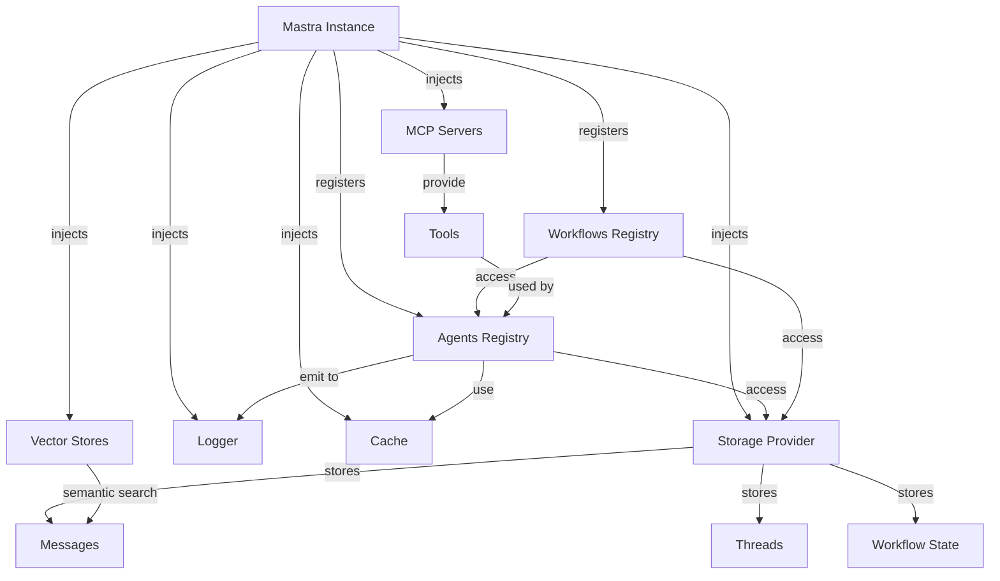
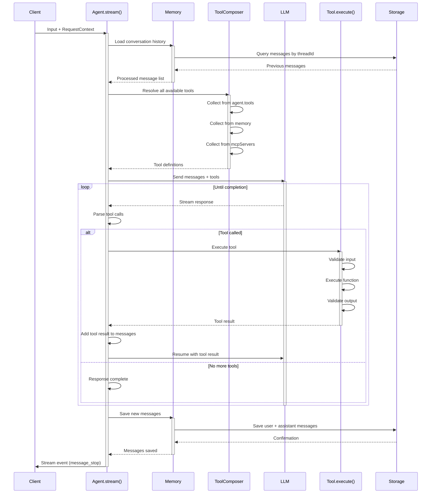
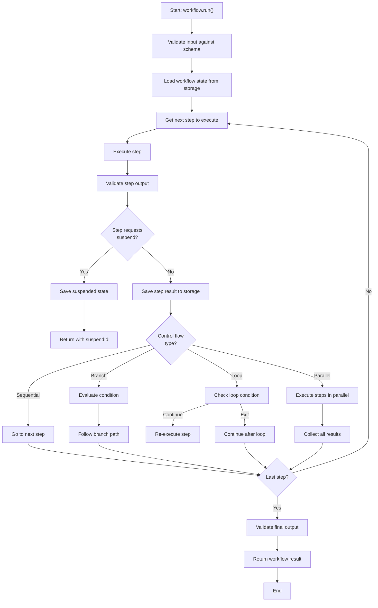
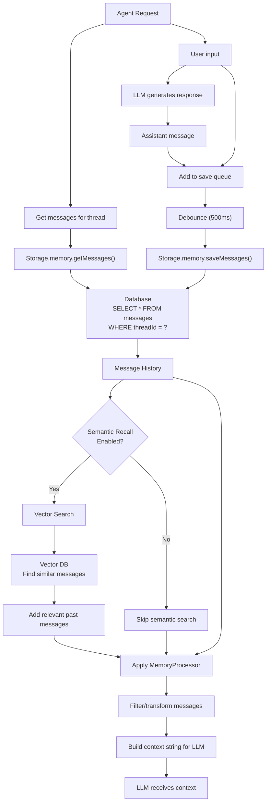
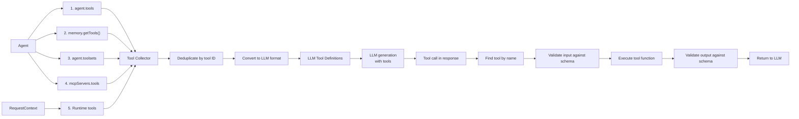
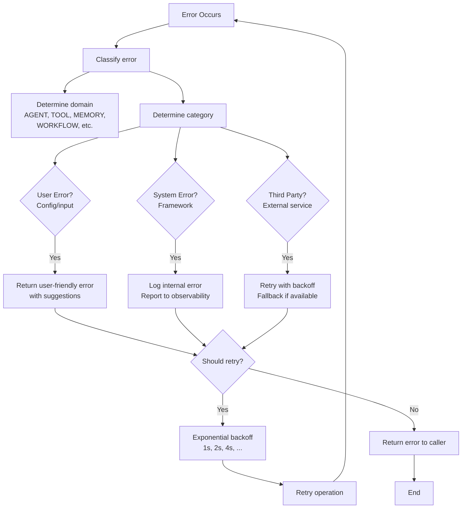

# Mastra Architecture Deep-Dive

## Table of Contents

1. [Architecture Overview](#architecture-overview)
2. [Core Components & Abstractions](#core-components--abstractions)
3. [Execution Lifecycle Walkthrough](#execution-lifecycle-walkthrough)
4. [Detailed Code Flow Examples](#detailed-code-flow-examples)
5. [Key Design Patterns](#key-design-patterns)
6. [Workflow Engine & Task Composition](#workflow-engine--task-composition)
7. [Memory Architecture](#memory-architecture)
8. [Tool Integration & MCP Support](#tool-integration--mcp-support)
9. [Error Handling & Reliability](#error-handling--reliability)
10. [Performance Considerations](#performance-considerations)
11. [Extensibility & Plugin Architecture](#extensibility--plugin-architecture)
12. [Security & Tool Execution Safety](#security--tool-execution-safety)
13. [Trade-Offs & Architectural Decisions](#trade-offs--architectural-decisions)
14. [Critical Files Reference](#critical-files-reference)
15. [Mermaid Diagrams](#mermaid-diagrams)
16. [Code Snippets & Examples](#code-snippets--examples)
17. [Comparison to Other SDKs](#comparison-to-other-sdks)

---

## Architecture Overview

### Mental Model: Modular Full-Stack Framework with Dependency Injection

Mastra is a **modular, TypeScript-based AI framework** designed for building production-grade agentic applications. Unlike event-driven orchestration frameworks or pure graph-based systems, Mastra uses a **centralized dependency injection (DI) container pattern** combined with a **plugin architecture** for maximum flexibility and composability.

Key architectural characteristics:

- **Central Registry Pattern**: The `Mastra` class acts as a centralized registry and dependency container
- **Pluggable Components**: Storage, memory, vectors, loggers, deployers, and tools are all swappable
- **Type-Safe Composition**: Heavy TypeScript generics for compile-time type safety across workflows and agents
- **Thread-Based Memory**: Conversations organized around threads with semantic recall capabilities
- **Full-Stack Integration**: Built-in support for server deployment, observability, and event streaming
- **Suspension & Resume**: Workflows support suspend/resume for human-in-the-loop interactions

### Philosophy & Design Principles

1. **Declarative Configuration, Imperative Execution**: Configuration is declarative (what to use), execution logic is imperative (how to use it)

2. **Composition Over Inheritance**: Tools, memory backends, and storage are composed into agents rather than inherited

3. **TypeScript-First**: Full type inference support through generic constraints and utility types

4. **Plugin-Based Extensibility**: Any storage, memory, vector, or logging backend can be swapped at runtime

5. **Observability as First-Class**: Built-in tracing, logging, and event emission across all layers

6. **Dependency Injection**: All dependencies flow through a central container, enabling runtime configuration and testing

7. **Resource-Aware Context**: Thread and resource IDs flow through execution context for multi-tenancy

### Execution Model: Request-Scoped Context with Async Workflows

Mastra's execution model is built on:

```
RequestContext (DI Container)
  ├─ Agent.generate() / Agent.stream()
  ├─ Workflow.run()
  └─ Tool.execute()
      └─ Memory operations
      └─ Storage operations
      └─ Observability tracking
```

Each execution is scoped to a `RequestContext` which carries:
- Thread IDs for memory organization
- Resource IDs for multi-tenancy
- User metadata
- Tracing context for observability

---

## Core Components & Abstractions

### 1. Mastra (Central Registry & DI Container)

**File**: `/Users/bharatbvs/Desktop/ai-agent-repo/mastra/packages/core/src/mastra/index.ts` (103,152 lines)

The `Mastra` class is the top-level entry point for all Mastra applications. It acts as a registry for all application components and provides dependency resolution.

```typescript
export interface Config<
  TAgents extends Record<string, Agent<any>> = Record<string, Agent<any>>,
  TWorkflows extends Record<string, Workflow<any, any, any, any, any, any, any>> = Record<
    string,
    Workflow<any, any, any, any, any, any, any>
  >,
  TVectors extends Record<string, MastraVector<any>> = Record<string, MastraVector<any>>,
  TTTS extends Record<string, MastraTTS> = Record<string, MastraTTS>,
  TLogger extends IMastraLogger = IMastraLogger,
  TMCPServers extends Record<string, MCPServerBase<any>> = Record<string, MCPServerBase<any>>,
  TScorers extends Record<string, MastraScorer<any, any, any, any>> = Record<string, MastraScorer<any, any, any, any>>,
  TTools extends Record<string, ToolAction<any, any, any, any, any, any>> = Record<
    string,
    ToolAction<any, any, any, any, any, any>
  >,
> {
  agents?: { [K in keyof TAgents]: TAgents[K] | ToolLoopAgentLike };
  storage?: MastraCompositeStore;
  vectors?: TVectors;
  logger?: TLogger | false;
  workflows?: TWorkflows;
  tts?: TTTS;
  observability?: ObservabilityEntrypoint;
  idGenerator?: MastraIdGenerator;
  deployer?: MastraDeployer;
  server?: ServerConfig;
  mcpServers?: TMCPServers;
  bundler?: BundlerConfig;
  pubsub?: PubSub;
  scorers?: TScorers;
  tools?: TTools;
  processors?: TProcessors;
  memory?: TMemory;
  gateways?: Record<string, MastraModelGateway>;
  events?: {
    [topic: string]: (
      event: Event,
      cb?: () => Promise<void>,
    ) => Promise<void> | ((event: Event, cb?: () => Promise<void>) => Promise<void>)[];
  };
}

export class Mastra<
  TAgents extends Record<string, Agent<any>> = Record<string, Agent<any>>,
  TWorkflows extends Record<string, Workflow<any, any, any, any, any, any, any>> = Record<
    string,
    Workflow<any, any, any, any, any, any, any>
  >,
  // ... additional type parameters for vectors, TTS, loggers, etc.
> {
  private agents: Map<string, Agent>;
  private workflows: Map<string, Workflow>;
  private storage?: MastraCompositeStore;
  private vectors?: Record<string, MastraVector>;
  private logger: IMastraLogger;
  private cache: MastraServerCache;
  private pubsub: PubSub;
  private observability: ObservabilityEntrypoint;

  getAgent<K extends keyof TAgents>(name: K): TAgents[K];
  getWorkflow<K extends keyof TWorkflows>(name: K): TWorkflows[K];
  getStorage(): MastraCompositeStore | undefined;
  getVector<K extends keyof TVectors>(name: K): TVectors[K];
  registerAgent<K extends string, A extends Agent>(name: K, agent: A): void;
  registerWorkflow<K extends string, W extends Workflow>(name: K, workflow: W): void;
}
```

**Key Methods**:
- `getAgent(name)` - Retrieve an agent instance
- `getWorkflow(name)` - Retrieve a workflow instance
- `getStorage()` - Retrieve storage provider
- `getVector(name)` - Retrieve vector store
- `registerAgent(name, agent)` - Register an agent dynamically
- `registerWorkflow(name, workflow)` - Register a workflow dynamically

### 2. Agent (AI Executor)

**File**: `/Users/bharatbvs/Desktop/ai-agent-repo/mastra/packages/core/src/agent/agent.ts` (2,300+ lines)

The `Agent` is the primary interface for LLM interactions. It manages tool composition, memory access, and execution parameters.

```typescript
export class Agent<
  TAgentId extends string = string,
  TTools extends ToolsInput = ToolsInput,
  TOutput = undefined,
> extends MastraBase {
  public id: TAgentId;
  public name: string;
  #instructions: DynamicAgentInstructions;
  model: DynamicArgument<MastraModelConfig> | ModelFallbacks;
  #memory?: DynamicArgument<MastraMemory>;
  #workflows?: DynamicArgument<Record<string, Workflow<any, any, any, any, any, any, any>>>;
  #tools: DynamicArgument<TTools>;
  #scorers: DynamicArgument<MastraScorers>;
  #agents: DynamicArgument<Record<string, Agent>>;
  #voice: MastraVoice;
  #inputProcessors?: DynamicArgument<InputProcessorOrWorkflow[]>;
  #outputProcessors?: DynamicArgument<OutputProcessorOrWorkflow[]>;

  constructor(config: AgentConfig<TAgentId, TTools, TOutput>);

  async generate(
    input: MastraPrimitives | MastraUnion,
    options?: AgentGenerateOptions,
  ): Promise<GenerateTextResult>;

  stream(
    input: MastraPrimitives | MastraUnion,
    options?: AgentStreamOptions,
  ): Promise<MastraAgentNetworkStream>;

  async voice(
    audio: ArrayBuffer | ReadableStream<Uint8Array>,
    options?: VoiceOptions,
  ): Promise<VoiceResult>;
}
```

**Key Methods**:
- `generate(input, options)` - Get single response
- `stream(input, options)` - Stream response in real-time
- `voice(audio, options)` - Process voice input
- `withTools(tools)` - Add tools dynamically
- `withMemory(memory)` - Set memory backend
- `withInstructions(instructions)` - Override instructions

### 3. RequestContext (Dependency Injection Container)

**File**: `/Users/bharatbvs/Desktop/ai-agent-repo/mastra/packages/core/src/request-context/index.ts` (142 lines)

The `RequestContext` is a typed key-value store that flows through all execution contexts, enabling:
- Multi-tenancy through resource IDs
- Thread tracking for memory
- Dynamic configuration
- Type-safe dependency access

```typescript
export const MASTRA_RESOURCE_ID_KEY = 'mastra__resourceId';
export const MASTRA_THREAD_ID_KEY = 'mastra__threadId';

export class RequestContext<Values extends Record<string, any> | unknown = unknown> {
  private registry = new Map<string, unknown>();

  constructor(iterable?: Values extends Record<string, any>
    ? RecordToTuple<Partial<Values>>
    : Iterable<readonly [string, unknown]>);

  public set<K extends Values extends Record<string, any> ? keyof Values : string>(
    key: K,
    value: Values extends Record<string, any> ? (K extends keyof Values ? Values[K] : never) : unknown,
  ): void;

  public get<K extends Values extends Record<string, any> ? keyof Values : string>
    (key: K): R;

  public has<K extends Values extends Record<string, any> ? keyof Values : string>(
    key: K,
  ): boolean;
}
```

### 4. Workflow Engine (Step-Based Orchestration)

**File**: `/Users/bharatbvs/Desktop/ai-agent-repo/mastra/packages/core/src/workflows/workflow.ts` (1,000+ lines)

Workflows provide type-safe, composable task orchestration with:
- Sequential and parallel execution
- Suspend/resume for human-in-the-loop
- Automatic state persistence
- Event streaming

```typescript
export class Workflow<
  TSteps extends StepsRecord = StepsRecord,
  TStepNames extends keyof TSteps = keyof TSteps,
  TTriggerSchema extends ZodLikeSchema | undefined = undefined,
  TInputType extends InferZodLikeSchema<TTriggerSchema> = InferZodLikeSchema<TTriggerSchema>,
  TOutput = undefined,
  TEngineType extends WorkflowEngineType = 'default',
  TFormat extends 'stream' | 'run' = 'stream',
> extends MastraBase {
  private steps: Map<string, Step>;
  private config: WorkflowConfig;
  private executionEngine: ExecutionEngine;

  constructor(config: WorkflowConfig<TSteps, TTriggerSchema, TOutput>);

  async run(input: TInputType, options?: WorkflowOptions): Promise<WorkflowResult>;

  stream(input: TInputType, options?: WorkflowOptions): AsyncIterable<StreamEvent>;

  async resume(
    runId: string,
    stepId: string,
    resumeData: unknown,
    options?: WorkflowOptions,
  ): Promise<WorkflowResult>;
}
```

**Key Methods**:
- `run(input, options)` - Execute workflow synchronously
- `stream(input, options)` - Execute with event streaming
- `resume(runId, stepId, data)` - Resume from suspension
- `validateInput(input)` - Type-check input schema
- `getSteps()` - Retrieve all steps

### 5. Memory System (Thread-Based Conversation Storage)

**File**: `/Users/bharatbvs/Desktop/ai-agent-repo/mastra/packages/core/src/memory/memory.ts` (500+ lines)

The memory system provides:
- Thread-based conversation organization
- Semantic similarity search via vector stores
- Working memory for structured state
- Message history with metadata

```typescript
export abstract class MastraMemory extends MastraBase {
  readonly id: string;
  MAX_CONTEXT_TOKENS?: number;
  protected _storage?: MastraCompositeStore;
  protected _vector?: MastraVector;
  protected _embedding?: MastraEmbeddingModel;

  abstract getMessages(
    input: StorageListMessagesInput,
  ): Promise<MastraDBMessage[] | undefined>;

  abstract saveMessages(
    messages: MastraDBMessage[],
    input: MemoryRequestContext,
  ): Promise<void>;

  abstract getThread(
    input: Omit<MemoryRequestContext, 'newMessages'>,
  ): Promise<StorageThreadType | undefined>;

  abstract getContext(
    input: MemoryRequestContext,
  ): Promise<{
    context: string;
    sources?: string[];
  }>;

  abstract cloneThread(input: StorageCloneThreadInput): Promise<StorageCloneThreadOutput>;
}
```

### 6. Tool System (Composable Tool Framework)

**File**: `/Users/bharatbvs/Desktop/ai-agent-repo/mastra/packages/core/src/tools/tool.ts` (400+ lines)

Tools are type-safe functions that agents can invoke. They support:
- Input/output validation with Zod
- Suspension for human approval
- Mastra context access
- Error handling with recovery

```typescript
export class Tool<
  TSchemaIn = unknown,
  TSchemaOut = unknown,
  TSuspendSchema = unknown,
  TResumeSchema = unknown,
  TContext extends ToolExecutionContext<TSuspendSchema, TResumeSchema> = ToolExecutionContext<
    TSuspendSchema,
    TResumeSchema
  >,
  TId extends string = string,
> implements ToolAction<TSchemaIn, TSchemaOut, TSuspendSchema, TResumeSchema, TContext, TId> {
  id: TId;
  description: string;
  inputSchema?: SchemaWithValidation<TSchemaIn>;
  outputSchema?: SchemaWithValidation<TSchemaOut>;
  requireApproval?: boolean;
  execute: (input: TSchemaIn, context?: TContext) => Promise<TSchemaOut>;
  suspend?: (input: TSchemaIn) => TSuspendSchema;
  resume?: (resumeData: TResumeSchema) => Promise<TSchemaOut>;
}
```

### 7. MCP Server Integration (Model Context Protocol)

**File**: `/Users/bharatbvs/Desktop/ai-agent-repo/mastra/packages/core/src/mcp/index.ts` (300+ lines)

MCP servers expose tools and resources that agents can use:

```typescript
export abstract class MCPServerBase<TId extends string = string> extends MastraBase {
  public readonly name: string;
  public readonly version: string;
  public readonly description?: string;
  public readonly instructions?: string;
  public readonly releaseDate: string;
  public readonly isLatest: boolean;
  public convertedTools: Record<string, InternalCoreTool>;
  public mastra: Mastra | undefined;

  abstract convertTools(
    tools: ToolsInput,
    agents?: MCPServerConfig['agents'],
    workflows?: MCPServerConfig['workflows'],
  ): Promise<Record<string, InternalCoreTool>>;

  abstract executeToolCall(
    toolId: string,
    toolName: string,
    input: any,
  ): Promise<string | ToolResult>;
}
```

---

## Execution Lifecycle Walkthrough

### Agent Execution Flow: `agent.stream()`

```
1. Input Validation
   └─ Resolve thread ID from context or parameters
   └─ Validate input type

2. Memory Setup
   └─ Load conversation history
   └─ Apply memory processor (filter, transform messages)
   └─ Build system messages (instructions + memory context)

3. Tool Composition
   └─ Collect tools from:
      ├─ agent.tools (direct)
      ├─ agent.memory.memory (if memory enabled)
      ├─ agent.toolsets (named tool sets)
      └─ agent.mcpServers (if connected)

4. LLM Model Resolution
   └─ Resolve model ID from config
   └─ Apply model fallbacks if specified
   └─ Get model gateway (OpenAI, Anthropic, etc.)

5. Input Processing (if processors enabled)
   └─ Run input processors
   └─ Can abort, retry, or transform messages

6. LLM Generation
   └─ Stream LLM response with tool calls
   └─ Parse tool use messages

7. Tool Execution
   └─ Validate tool input
   └─ Check approval requirements
   └─ Execute with context (mastra instance, thread ID)
   └─ Handle suspend requests
   └─ Output validation

8. Output Processing (if processors enabled)
   └─ Run output processors
   └─ Can abort, retry, or transform

9. Memory Persistence
   └─ Save user/assistant messages
   └─ Update working memory if configured
   └─ Queue for async save if needed

10. Response Streaming
    └─ Emit stream events:
       ├─ message_start
       ├─ tool_call
       ├─ tool_result
       └─ message_stop
```

### Workflow Execution Flow: `workflow.run()`

```
1. Validation
   └─ Validate input against trigger schema
   └─ Initialize execution context

2. Persistence Setup
   └─ Load workflow run state from storage
   └─ Determine starting step

3. Step Execution Loop
   ├─ Get next step from execution order
   ├─ Validate step input schema
   ├─ Execute step:
   │  ├─ Call step's execute() function
   │  ├─ Map variables from previous steps
   │  └─ Handle tool steps (call tools)
   ├─ Validate step output against schema
   ├─ Handle suspend/resume:
   │  └─ Persist state to storage
   │  └─ Return with suspendId for resumption
   ├─ Handle branching:
   │  └─ Evaluate condition functions
   │  └─ Determine next step
   ├─ Handle loops:
   │  └─ Evaluate loop conditions
   │  └─ Increment iteration counter
   └─ Handle parallel:
      └─ Execute multiple steps concurrently
      └─ Collect results

4. Error Handling
   ├─ Step execution error:
   │  ├─ Log error
   │  ├─ Capture in output
   │  └─ Potentially halt or continue
   └─ Retry logic (if configured):
      └─ Re-execute step with backoff

5. State Persistence
   └─ After each step, save to storage:
      ├─ Step results
      ├─ Current state
      └─ Timestamp

6. Completion
   └─ Validate final output
   └─ Emit completion events
   └─ Return result
```

---

## Detailed Code Flow Examples

### Example 1: Creating and Using an Agent

```typescript
import { Agent } from '@mastra/core/agent';
import { Memory } from '@mastra/memory';
import { createTool } from '@mastra/core/tools';
import { z } from 'zod';

// Define a tool
const weatherTool = createTool({
  id: 'get-weather',
  description: 'Get weather for a location',
  inputSchema: z.object({
    location: z.string(),
    units: z.enum(['celsius', 'fahrenheit']).optional(),
  }),
  execute: async (input) => {
    const response = await fetch(
      `https://api.weather.example.com?location=${input.location}&units=${input.units || 'celsius'}`,
    );
    return response.json();
  },
});

// Create agent with memory
const agent = new Agent({
  id: 'weather-agent',
  name: 'Weather Assistant',
  instructions: 'You are a helpful weather assistant. Always provide temperature in both Celsius and Fahrenheit.',
  model: 'openai/gpt-4',
  tools: {
    weather: weatherTool,
  },
  memory: new Memory(),
  maxRetries: 2,
});

// Use the agent
const response = await agent.generate(
  'What is the weather in San Francisco?',
  {
    threadId: 'user-123-thread',
    resourceId: 'user-123',
  },
);

console.log(response.text);
```

**Execution Flow**:
1. Input validation: Check input is string
2. Memory setup: Load thread history from Memory
3. Tool composition: Collect weather tool
4. Model resolution: Get OpenAI gpt-4 model config
5. Generate: Call model with tools
6. Tool execution: Execute weather tool if model calls it
7. Message persistence: Save to memory
8. Stream response: Return text and usage

### Example 2: Creating a Workflow with Steps

```typescript
import { createWorkflow, createStep } from '@mastra/core/workflows';
import { z } from 'zod';
import { Mastra } from '@mastra/core';

// Create workflow steps
const fetchUserData = createStep({
  id: 'fetch-user',
  inputSchema: z.object({
    userId: z.string(),
  }),
  outputSchema: z.object({
    id: z.string(),
    name: z.string(),
    email: z.string(),
  }),
  execute: async (input) => {
    const response = await fetch(`/api/users/${input.userId}`);
    return response.json();
  },
});

const validateEmail = createStep({
  id: 'validate-email',
  inputSchema: z.object({
    email: z.string(),
  }),
  outputSchema: z.object({
    valid: z.boolean(),
    reason: z.string().optional(),
  }),
  execute: async (input) => {
    const isValid = /^[^\s@]+@[^\s@]+\.[^\s@]+$/.test(input.email);
    return {
      valid: isValid,
      reason: isValid ? undefined : 'Invalid email format',
    };
  },
});

const notifyUser = createStep({
  id: 'notify-user',
  inputSchema: z.object({
    userId: z.string(),
    message: z.string(),
  }),
  outputSchema: z.object({
    notified: z.boolean(),
  }),
  execute: async (input) => {
    console.log(`Notifying user ${input.userId}: ${input.message}`);
    return { notified: true };
  },
});

// Create workflow
const workflow = createWorkflow({
  id: 'user-validation',
  triggerSchema: z.object({
    userId: z.string(),
  }),
  steps: {
    fetch: fetchUserData,
    validate: validateEmail,
    notify: notifyUser,
  },
})
  .step('fetch')
  .after('fetch')
  .step('validate')
  .inputSchema(({ fetch }) => ({
    email: fetch.email,
  }))
  .after('validate')
  .step('notify')
  .inputSchema(({ fetch, validate }) => ({
    userId: fetch.id,
    message: validate.valid ? 'Email verified!' : 'Email verification failed',
  }));

// Execute workflow
const result = await workflow.run({
  userId: 'user-123',
});

console.log(result.output);
```

**Execution Flow**:
1. Validate `userId` against triggerSchema
2. Execute `fetch` step: Get user data
3. Map variables: Extract email from fetch output
4. Execute `validate` step: Check email format
5. Map variables: Build notify input from previous results
6. Execute `notify` step: Send notification
7. Persist state to storage
8. Return final result

### Example 3: Multi-Agent Setup with Mastra Registry

```typescript
import { Mastra } from '@mastra/core';
import { Agent } from '@mastra/core/agent';
import { LibSQLStore } from '@mastra/sqlite';
import { ConsoleLogger } from '@mastra/core/logger';

// Create storage
const storage = new LibSQLStore({
  id: 'mastra-storage',
  url: 'file:./mastra.db',
});

// Create agents
const researchAgent = new Agent({
  id: 'research-agent',
  name: 'Research Agent',
  instructions: 'You are a research assistant. Find and analyze information.',
  model: 'openai/gpt-4',
  tools: { /* research tools */ },
});

const writerAgent = new Agent({
  id: 'writer-agent',
  name: 'Writer Agent',
  instructions: 'You are a writer. Create compelling content.',
  model: 'openai/gpt-4',
  tools: { /* writing tools */ },
});

// Create Mastra registry
const mastra = new Mastra({
  agents: {
    research: researchAgent,
    writer: writerAgent,
  },
  storage,
  logger: new ConsoleLogger({ name: 'MyApp' }),
});

// Access agents
const agent = mastra.getAgent('research');

// Generate response through registry context
const response = await agent.generate('Research AI trends in 2024');
```

**Dependency Injection Flow**:
1. Mastra constructor receives agents
2. Agents stored in internal Map with keys
3. On `mastra.getAgent('research')`, return agent instance
4. Agent can access storage via `mastra.getStorage()`
5. All logging flows through configured logger

---

## Key Design Patterns

### 1. Dependency Injection Container

The `Mastra` class acts as a service locator and DI container:

```typescript
// Configuration-time injection
const mastra = new Mastra({
  agents: { weatherAgent },
  storage: sqliteStore,
  logger: customLogger,
  vectors: { chromaStore },
});

// Runtime dependency resolution
const storage = mastra.getStorage(); // Returns MastraCompositeStore | undefined
const agent = mastra.getAgent('weatherAgent'); // Returns Agent instance
const vector = mastra.getVector('chroma'); // Returns vector store

// Context-based dependency injection
const requestContext = new RequestContext();
requestContext.set(MASTRA_THREAD_ID_KEY, 'thread-123');
requestContext.set(MASTRA_RESOURCE_ID_KEY, 'user-456');
// Flows through entire execution
```

**Benefits**:
- Loose coupling between components
- Easy to swap implementations (testing, multi-backend)
- Runtime configuration possible
- Type-safe with TypeScript generics

### 2. Plugin Architecture for Storage Backends

All storage operations go through a unified interface:

```typescript
export interface MastraCompositeStore {
  memory: StorageMemoryDomain;
  workflows: StorageWorkflowDomain;
  agents: StorageAgentDomain;
  scores: StorageScoreDomain;
  // ... other domains
}

// Implementations can be swapped
const storage = process.env.DB_TYPE === 'postgres'
  ? new PostgresStore(config)
  : new LibSQLStore(config);

const mastra = new Mastra({ storage });
```

### 3. Memory Backend Strategy Pattern

Different memory implementations for different use cases:

```typescript
// Simple in-memory (development)
const memory = new InMemoryMemory();

// Production with PostgreSQL
const memory = new Memory({
  storage: postgresStore,
  vector: pineconeVector,
  embedding: openaiEmbedding,
});

// With semantic recall
const memory = new Memory({
  storage,
  vector,
  config: {
    semanticRecall: true,
    lastMessages: 20,
  },
});

agent.withMemory(memory);
```

### 4. Dynamic Tool Composition

Tools are composed from multiple sources:

```typescript
// Tools flow through composition pipeline
const tools = {
  ...agentDefinedTools,
  ...memoryTools, // Memory can provide tools
  ...toolsetsTools, // Named tool collections
  ...mcpTools, // From MCP servers
  ...requestContextTools, // Runtime-provided
};

// Resolved at execution time
async function generateWithTools() {
  const allTools = await resolveTools(agent, requestContext);
  // Pass to LLM...
}
```

### 5. Type-Safe Step Composition in Workflows

Workflows use TypeScript generics for type safety:

```typescript
// Step output types are tracked
const step1 = createStep({
  outputSchema: z.object({ id: z.string(), name: z.string() }),
  execute: async () => ({ id: '1', name: 'Result' }),
});

// Next step can reference previous results with type safety
workflow
  .after(step1) // Type knows step1 output shape
  .step(step2)
  .inputSchema(({ step1: prevOutput }) => ({
    // prevOutput is typed as { id: string; name: string }
    userId: prevOutput.id,
  }));
```

### 6. Error Domain & Category System

Structured error handling:

```typescript
export enum ErrorDomain {
  AGENT = 'AGENT',
  TOOL = 'TOOL',
  MEMORY = 'MEMORY',
  WORKFLOW = 'WORKFLOW',
  // ...
}

export enum ErrorCategory {
  USER = 'USER',      // User configuration error
  SYSTEM = 'SYSTEM',  // Internal framework error
  THIRD_PARTY = 'THIRD_PARTY', // External service error
}

// Creating errors with context
throw new MastraError({
  id: 'AGENT_TOOL_EXECUTION_FAILED',
  domain: ErrorDomain.AGENT,
  category: ErrorCategory.THIRD_PARTY,
  text: 'Tool execution failed',
  details: { toolId: 'get-weather', reason: 'API timeout' },
});
```

---

## Workflow Engine & Task Composition

### Step Types & Execution

**File**: `/Users/bharatbvs/Desktop/ai-agent-repo/mastra/packages/core/src/workflows/step.ts` (500+ lines)

Workflows support multiple step types:

1. **Function Steps**: Execute arbitrary async functions
   ```typescript
   const step = createStep({
     execute: async (input) => {
       // Custom logic
       return result;
     },
   });
   ```

2. **Tool Steps**: Execute tools with validation
   ```typescript
   const step = createStep({
     tools: { calculator: calcTool },
     execute: async (input, { tools }) => {
       return await tools.calculator({ expression: '2+2' });
     },
   });
   ```

3. **Agent Steps**: Use agents as steps
   ```typescript
   const step = createStep({
     execute: async (input) => {
       return await agent.generate(input.prompt);
     },
   });
   ```

### Control Flow Structures

**File**: `/Users/bharatbvs/Desktop/ai-agent-repo/mastra/packages/core/src/workflows/handlers/control-flow.ts`

```typescript
// Sequential (default)
workflow.step(step1).after(step1).step(step2);

// Parallel
workflow.parallel([step1, step2, step3]).after(results).step(step4);

// Branching
workflow
  .step(condition)
  .branch({
    true: () => workflow.step(successPath),
    false: () => workflow.step(failurePath),
  })
  .after(branches)
  .step(continue);

// Looping
workflow
  .step(fetchItem)
  .loop({
    while: (result) => result.hasMore,
    do: (result) => workflow.step(processItem),
  })
  .after(loop)
  .step(finalize);
```

### State Persistence & Resumption

Workflows can suspend for human-in-the-loop:

```typescript
const step = createStep({
  execute: async (input) => {
    // Suspend execution
    throw new SuspendWorkflow({
      reason: 'Awaiting approval',
      data: { itemId: '123', action: 'delete' },
    });
  },
});

// Later, resume from suspension
const result = await workflow.resume(
  'run-456',
  'step-789',
  { approved: true },
);
```

---

## Memory Architecture

### Thread-Based Organization

**File**: `/Users/bharatbvs/Desktop/ai-agent-repo/mastra/packages/core/src/memory/types.ts`

```typescript
export interface StorageThreadType {
  id: string;
  resourceId: string;
  title?: string;
  createdAt: Date;
  updatedAt: Date;
  metadata?: Record<string, any>;
}

export interface StorageListMessagesInput {
  threadId: string;
  resourceId: string;
  limit?: number;
  offset?: number;
  orderBy?: 'asc' | 'desc';
}
```

Memory is organized into threads:
- One thread per conversation
- Messages tied to threadId + resourceId (multi-tenancy)
- Metadata tracking (created, updated, title)
- Semantic search via vector store

### Memory Components

1. **Message History**: All messages in a thread
2. **Semantic Recall**: Vector search for similar past messages
3. **Working Memory**: Structured state (user info, preferences, context)
4. **Entity Memory**: Track entities mentioned across conversations

```typescript
export interface MemoryConfig {
  lastMessages?: number; // How many recent messages to use
  semanticRecall?: boolean; // Enable vector search
  generateTitle?: boolean; // Auto-title threads
  workingMemory?: {
    enabled: boolean;
    template: string; // Structured format
  };
}
```

### Memory Processors

Filter/transform messages before LLM sees them:

```typescript
export abstract class MemoryProcessor extends MastraBase {
  process(messages: CoreMessage[]): CoreMessage[] | Promise<CoreMessage[]> {
    // Filter, summarize, or transform messages
    return messages;
  }
}

// Applied during agent execution
const agent = new Agent({
  memory: new Memory(),
  // ... other config
});
// Memory automatically applies processors
```

---

## Tool Integration & MCP Support

### Tool Creation & Validation

**File**: `/Users/bharatbvs/Desktop/ai-agent-repo/mastra/packages/core/src/tools/tool.ts`

```typescript
import { createTool } from '@mastra/core/tools';
import { z } from 'zod';

const createFileTool = createTool({
  id: 'create-file',
  description: 'Create a new file with content',

  // Input validation with Zod
  inputSchema: z.object({
    path: z.string(),
    content: z.string(),
    overwrite: z.boolean().optional(),
  }),

  // Output validation
  outputSchema: z.object({
    success: z.boolean(),
    path: z.string(),
    size: z.number(),
  }),

  // Main execution
  execute: async (input, context) => {
    const fs = await import('fs/promises');
    const exists = await fs.stat(input.path).catch(() => null);

    if (exists && !input.overwrite) {
      throw new Error('File exists and overwrite=false');
    }

    await fs.writeFile(input.path, input.content);
    const stat = await fs.stat(input.path);

    return {
      success: true,
      path: input.path,
      size: stat.size,
    };
  },

  // Approval flow
  requireApproval: true,
  suspend: (input) => ({
    path: input.path,
    contentPreview: input.content.slice(0, 100),
  }),

  // Resume after approval
  resume: async (resumeData) => {
    if (!resumeData.approved) {
      throw new Error('Approval denied');
    }
    // Continue execution...
  },
});
```

### Tool Registry & Resolution

Tools are resolved from multiple sources:

```typescript
// Tool composition sources (in order)
const allTools = {
  ...directTools,           // Agent.tools
  ...memoryTools,           // From memory system
  ...toolsetTools,          // Named sets
  ...mcpServerTools,        // MCP servers
  ...requestContextTools,   // Runtime-provided
};

// Agents can access via RequestContext
const context = new RequestContext();
const tools = agent.resolveDynamicTools(context);
```

### MCP Server Integration

```typescript
import { MCPServerBase } from '@mastra/core/mcp';

export class GitHubMCPServer extends MCPServerBase {
  name = 'github';
  version = '1.0.0';
  description = 'GitHub operations via MCP';

  async convertTools(tools: ToolsInput): Promise<Record<string, InternalCoreTool>> {
    // Convert OpenAPI specs or tool definitions to MCP format
    return {
      'get-repos': {
        id: 'get-repos',
        description: 'List GitHub repositories',
        inputSchema: { /* ... */ },
        execute: async (input) => {
          // Execute GitHub API call
        },
      },
      // ... more tools
    };
  }

  async executeToolCall(toolId: string, toolName: string, input: any) {
    // Handle tool execution through MCP protocol
  }
}

// Register with Mastra
const mastra = new Mastra({
  mcpServers: {
    github: new GitHubMCPServer({
      tokens: { github: process.env.GITHUB_TOKEN },
    }),
  },
});
```

---

## Error Handling & Reliability

### Error Classification System

**File**: `/Users/bharatbvs/Desktop/ai-agent-repo/mastra/packages/core/src/error/index.ts`

```typescript
export enum ErrorDomain {
  TOOL = 'TOOL',
  AGENT = 'AGENT',
  MCP = 'MCP',
  AGENT_NETWORK = 'AGENT_NETWORK',
  MASTRA_SERVER = 'MASTRA_SERVER',
  MASTRA_OBSERVABILITY = 'MASTRA_OBSERVABILITY',
  MASTRA_WORKFLOW = 'MASTRA_WORKFLOW',
  MASTRA_VOICE = 'MASTRA_VOICE',
  MASTRA_VECTOR = 'MASTRA_VECTOR',
  MASTRA_MEMORY = 'MASTRA_MEMORY',
  LLM = 'LLM',
  EVAL = 'EVAL',
  SCORER = 'SCORER',
  A2A = 'A2A',
  MASTRA_INSTANCE = 'MASTRA_INSTANCE',
  MASTRA = 'MASTRA',
  DEPLOYER = 'DEPLOYER',
  STORAGE = 'STORAGE',
  MODEL_ROUTER = 'MODEL_ROUTER',
}

export enum ErrorCategory {
  UNKNOWN = 'UNKNOWN',
  USER = 'USER',           // Configuration, input validation
  SYSTEM = 'SYSTEM',       // Framework internal errors
  THIRD_PARTY = 'THIRD_PARTY', // External service failures
}

export class MastraBaseError<DOMAIN, CATEGORY> extends Error {
  id: Uppercase<string>;
  domain: DOMAIN;
  category: CATEGORY;
  details?: Record<string, Json<Scalar>>;
  cause?: SerializableError;
}
```

### Retry Logic in Agents

```typescript
const agent = new Agent({
  id: 'robust-agent',
  model: 'openai/gpt-4',
  maxRetries: 3, // Retry up to 3 times on failure

  // Model fallbacks
  model: [
    { id: 'openai/gpt-4', maxRetries: 2 },
    { id: 'openai/gpt-3.5-turbo', maxRetries: 1 }, // Fallback
  ],
});

// Automatic retry with exponential backoff
// Failed requests retry with: 1s, 2s, 4s delays
```

### Tool Execution Error Handling

```typescript
const tool = createTool({
  execute: async (input) => {
    try {
      const result = await externalAPI(input);
      return result;
    } catch (error) {
      if (error.code === 'TIMEOUT') {
        // Recoverable - will trigger retry
        throw error;
      } else if (error.code === 'AUTH_FAILED') {
        // Non-recoverable
        throw new MastraError({
          id: 'TOOL_AUTH_ERROR',
          domain: ErrorDomain.TOOL,
          category: ErrorCategory.USER,
          text: 'Authentication failed for external service',
        });
      }
    }
  },
});
```

### Workflow Error Recovery

```typescript
const workflow = createWorkflow({
  steps: { /* ... */ },
})
  .step(unreliableStep)
  .catch((error) => {
    // Handle error, potentially skip or retry
    return defaultValue;
  })
  .after(unreliableStep)
  .step(nextStep);
```

---

## Performance Considerations

### Caching Strategy

**File**: `/Users/bharatbvs/Desktop/ai-agent-repo/mastra/packages/core/src/cache/base.ts`

```typescript
export interface MastraServerCache {
  get<T>(key: string): Promise<T | undefined>;
  set<T>(key: string, value: T, ttl?: number): Promise<void>;
  delete(key: string): Promise<void>;
  clear(): Promise<void>;
}

// Default in-memory cache
const cache = new InMemoryServerCache();

// Use in Mastra
const mastra = new Mastra({
  cache, // Provided to all agents for LLM response caching
});

// LLM responses are cached by default
// Cache key: hash(model_id, messages, parameters)
```

### Async Message Persistence

Messages aren't saved synchronously to avoid blocking:

```typescript
class SaveQueueManager {
  private queue: MastraDBMessage[] = [];

  async enqueue(messages: MastraDBMessage[]) {
    this.queue.push(...messages);
    // Debounced save to storage
    this.debouncedSave();
  }

  private debouncedSave = debounce(async () => {
    const toSave = [...this.queue];
    this.queue = [];
    await storage.memory.saveMessages(toSave);
  }, 500);
}
```

### Lazy Loading & Dynamic Resolution

Components are resolved at runtime, not initialization:

```typescript
// Tools aren't converted until needed
class Agent {
  #tools: DynamicArgument<ToolsInput>; // Lazy

  async resolveDynamicTools(context: RequestContext) {
    // Convert tools only when agent.generate() is called
    if (this.#tools instanceof Function) {
      return this.#tools(context);
    }
    return this.#tools;
  }
}
```

### Stream-Based Response Handling

Responses stream events to the client immediately:

```typescript
// Clients get real-time updates
const stream = await agent.stream(input);
for await (const event of stream) {
  switch (event.type) {
    case 'message_start':
      console.log('Message starting');
      break;
    case 'tool_call':
      console.log(`Tool called: ${event.toolName}`);
      break;
    case 'message_stop':
      console.log('Message complete');
      break;
  }
}
```

---

## Extensibility & Plugin Architecture

### Custom Storage Backend

Implement `MastraCompositeStore` interface:

```typescript
export class CustomStorage implements MastraCompositeStore {
  memory: StorageMemoryDomain;
  workflows: StorageWorkflowDomain;
  agents: StorageAgentDomain;
  // ... other domains

  async init() {
    // Initialize connections
  }
}

const storage = new CustomStorage();
const mastra = new Mastra({ storage });
```

### Custom Memory Implementation

Extend `MastraMemory` abstract class:

```typescript
export class CustomMemory extends MastraMemory {
  async getMessages(input: StorageListMessagesInput) {
    // Query messages from custom backend
  }

  async saveMessages(messages: MastraDBMessage[], context: MemoryRequestContext) {
    // Persist messages
  }

  async getContext(input: MemoryRequestContext) {
    // Build context string for LLM
  }
}

const memory = new CustomMemory({ id: 'custom-memory' });
agent.withMemory(memory);
```

### Custom Vector Store

Implement `MastraVector` interface:

```typescript
export interface MastraVector<TMetadata = Record<string, unknown>> {
  upsert(vectors: EmbeddingInput<TMetadata>[]): Promise<void>;
  query(query: QueryEmbeddingInput): Promise<QueryEmbeddingOutput<TMetadata>>;
  delete(ids: string[]): Promise<void>;
}

class CustomVector implements MastraVector {
  async upsert(vectors: EmbeddingInput[]) {
    // Store vectors in custom database
  }

  async query(input: QueryEmbeddingInput) {
    // Search vectors
  }
}
```

### Custom Logger

Implement `IMastraLogger` interface:

```typescript
export interface IMastraLogger {
  debug(message: string): void;
  info(message: string): void;
  warn(message: string): void;
  error(message: string | Error): void;
  trackException(error: Error): void;
}

class CustomLogger implements IMastraLogger {
  debug(message: string) {
    // Custom logging implementation
  }
  // ... other methods
}

const mastra = new Mastra({
  logger: new CustomLogger(),
});
```

---

## Security & Tool Execution Safety

### Tool Approval & Sandboxing

High-risk tools can require approval:

```typescript
const deleteFileTool = createTool({
  id: 'delete-file',
  description: 'Permanently delete a file',
  requireApproval: true, // Must be approved before execution

  suspend: (input) => ({
    path: input.path,
    size: getFileSize(input.path),
  }),

  execute: async (input, context) => {
    // Only executes after approval
    await fs.unlink(input.path);
    return { deleted: true };
  },
});
```

### Tool Input/Output Validation

```typescript
const tool = createTool({
  inputSchema: z.object({
    query: z.string().max(1000), // Max length
    limit: z.number().min(1).max(100), // Range validation
  }),

  outputSchema: z.object({
    results: z.array(z.object({ /* ... */ })),
    error: z.string().optional(),
  }).strict(), // No extra properties

  execute: async (input) => {
    // Input is type-safe and validated
    // Output must match schema
  },
});

// Validation happens:
// 1. Before execution (input validation)
// 2. After execution (output validation)
// 3. Fails fast with clear errors
```

### Resource ID Isolation (Multi-Tenancy)

```typescript
const requestContext = new RequestContext();
requestContext.set(MASTRA_RESOURCE_ID_KEY, 'user-123');
requestContext.set(MASTRA_THREAD_ID_KEY, 'thread-456');

// All storage operations scoped to this resource
// Cannot access another user's data
await agent.generate(input, { requestContext });

// Storage enforces:
// - Only return messages for this resource
// - Only update threads owned by this resource
```

### Thread ID Security

```typescript
// In middleware (Hono, Express, etc.)
const requestContext = c.get('requestContext');

// Prevent client from hijacking another user's thread
if (claims.userId === threadOwner) {
  requestContext.set(MASTRA_THREAD_ID_KEY, clientProvidedThreadId);
} else {
  requestContext.set(MASTRA_THREAD_ID_KEY, generateNewThreadId());
}

// Client cannot access threads they don't own
```

---

## Trade-Offs & Architectural Decisions

### 1. Centralized Registry vs Distributed Config

**Decision**: Centralized Mastra registry

**Rationale**:
- Enables dependency injection and lazy loading
- Easier to swap implementations for testing
- Type-safe component access

**Trade-off**:
- Requires passing Mastra instance through contexts
- Slightly more verbose setup vs direct references

### 2. Request-Scoped Context vs Global State

**Decision**: Request-scoped `RequestContext`

**Rationale**:
- Multi-tenancy support
- Thread-safe (no global mutations)
- Testing friendly

**Trade-off**:
- Must thread context through all functions
- More parameters in function signatures

### 3. Abstract Base Classes vs Interfaces

**Decision**: Mix of both

```typescript
// Stateful components: abstract classes (MastraMemory, Tool)
export abstract class MastraMemory extends MastraBase {
  abstract getMessages(...): Promise<...>;
}

// Stateless contracts: interfaces (MastraVector, MastraLogger)
export interface MastraVector<T> {
  query(...): Promise<...>;
}
```

**Rationale**:
- Base classes enable shared behavior (logging, error handling)
- Interfaces keep contracts lightweight

**Trade-off**:
- Less flexibility than pure interfaces
- Inheritance coupling

### 4. Type Inference via Generics vs Runtime Schemas

**Decision**: Both - generics for TypeScript, Zod for validation

```typescript
// Generic types for IDE support
const workflow = createWorkflow({
  outputSchema: z.object({ id: z.string() }),
  // ... steps
});

// Zod schema for runtime validation
const result = workflow.run(input);
// Validates against schema at runtime
```

**Rationale**:
- Compile-time safety via TypeScript
- Runtime validation prevents invalid data

**Trade-off**:
- Duplication of schema information
- Type inference can be complex

### 5. Async Persistence vs Synchronous

**Decision**: Asynchronous message persistence

**Rationale**:
- Non-blocking user interactions
- Better throughput
- Debounced batching of saves

**Trade-off**:
- Messages may not be persisted immediately
- Slight complexity in SaveQueueManager

### 6. Dynamic vs Static Tool Binding

**Decision**: Dynamic tool resolution at runtime

```typescript
#tools: DynamicArgument<ToolsInput>; // Function or static

resolveDynamicTools(context: RequestContext) {
  if (typeof this.#tools === 'function') {
    return this.#tools(context); // Call function
  }
  return this.#tools;
}
```

**Rationale**:
- Tools can be provided at runtime
- Context-dependent tool availability
- Testing with mock tools

**Trade-off**:
- Less efficient (function calls)
- Type inference complexity

---

## Critical Files Reference

### Core Framework

| File | Lines | Purpose |
|------|-------|---------|
| `/Users/bharatbvs/Desktop/ai-agent-repo/mastra/packages/core/src/mastra/index.ts` | 103,152 | Central registry, DI container, Mastra class |
| `/Users/bharatbvs/Desktop/ai-agent-repo/mastra/packages/core/src/agent/agent.ts` | 2,300+ | Agent class, generate/stream methods, tool execution |
| `/Users/bharatbvs/Desktop/ai-agent-repo/mastra/packages/core/src/workflows/workflow.ts` | 1,000+ | Workflow orchestration, step execution engine |
| `/Users/bharatbvs/Desktop/ai-agent-repo/mastra/packages/core/src/request-context/index.ts` | 142 | RequestContext DI container |
| `/Users/bharatbvs/Desktop/ai-agent-repo/mastra/packages/core/src/base.ts` | 28 | MastraBase class with logging |

### Memory & Storage

| File | Lines | Purpose |
|------|-------|---------|
| `/Users/bharatbvs/Desktop/ai-agent-repo/mastra/packages/core/src/memory/memory.ts` | 500+ | MastraMemory abstract class |
| `/Users/bharatbvs/Desktop/ai-agent-repo/mastra/packages/core/src/memory/types.ts` | 200+ | Memory configuration types |
| `/Users/bharatbvs/Desktop/ai-agent-repo/mastra/packages/core/src/storage/index.ts` | 1,000+ | Storage interface definitions |

### Tools & Integration

| File | Lines | Purpose |
|------|-------|---------|
| `/Users/bharatbvs/Desktop/ai-agent-repo/mastra/packages/core/src/tools/tool.ts` | 400+ | Tool class, execution, validation |
| `/Users/bharatbvs/Desktop/ai-agent-repo/mastra/packages/core/src/tools/types.ts` | 200+ | Tool type definitions |
| `/Users/bharatbvs/Desktop/ai-agent-repo/mastra/packages/core/src/mcp/index.ts` | 300+ | MCPServerBase class, tool integration |

### Error Handling & Logging

| File | Lines | Purpose |
|------|-------|---------|
| `/Users/bharatbvs/Desktop/ai-agent-repo/mastra/packages/core/src/error/index.ts` | 200+ | Error types, ErrorDomain, ErrorCategory |
| `/Users/bharatbvs/Desktop/ai-agent-repo/mastra/packages/core/src/logger/index.ts` | 300+ | Logger interface, ConsoleLogger, PinoLogger |
| `/Users/bharatbvs/Desktop/ai-agent-repo/mastra/packages/core/src/logger/constants.ts` | - | RegisteredLogger enum |

### Caching & Performance

| File | Lines | Purpose |
|------|-------|---------|
| `/Users/bharatbvs/Desktop/ai-agent-repo/mastra/packages/core/src/cache/base.ts` | 50+ | MastraServerCache interface |
| `/Users/bharatbvs/Desktop/ai-agent-repo/mastra/packages/core/src/cache/inmemory.ts` | 100+ | InMemoryServerCache implementation |
| `/Users/bharatbvs/Desktop/ai-agent-repo/mastra/packages/core/src/agent/save-queue.ts` | - | SaveQueueManager for debounced persistence |

### Workflows

| File | Lines | Purpose |
|------|-------|---------|
| `/Users/bharatbvs/Desktop/ai-agent-repo/mastra/packages/core/src/workflows/step.ts` | 500+ | Step creation, execution |
| `/Users/bharatbvs/Desktop/ai-agent-repo/mastra/packages/core/src/workflows/execution-engine.ts` | 400+ | Step execution orchestration |
| `/Users/bharatbvs/Desktop/ai-agent-repo/mastra/packages/core/src/workflows/handlers/control-flow.ts` | - | Branching, looping, parallel execution |

### Observability

| File | Lines | Purpose |
|------|-------|---------|
| `/Users/bharatbvs/Desktop/ai-agent-repo/mastra/packages/core/src/observability/index.ts` | 500+ | Observability entrypoint, tracing |
| `/Users/bharatbvs/Desktop/ai-agent-repo/mastra/packages/core/src/observability/types/index.ts` | - | Tracing context, span types |

---

## Mermaid Diagrams

### Diagram 1: Mastra DI Container Architecture



### Diagram 2: Agent Execution Flow



### Diagram 3: Workflow Execution with State Persistence



### Diagram 4: Memory System Architecture



### Diagram 5: Tool Composition & Resolution Pipeline



### Diagram 6: Error Classification & Handling



---

## Code Snippets & Examples

### Snippet 1: Complete Multi-Agent Conversation with Memory

```typescript
import { Mastra } from '@mastra/core';
import { Agent } from '@mastra/core/agent';
import { Memory } from '@mastra/memory';
import { PostgresStore } from '@mastra/postgres';
import { createTool } from '@mastra/core/tools';
import { z } from 'zod';

// Define tools
const searchTool = createTool({
  id: 'search-web',
  description: 'Search the web for information',
  inputSchema: z.object({
    query: z.string(),
    limit: z.number().optional().default(5),
  }),
  outputSchema: z.object({
    results: z.array(z.object({
      title: z.string(),
      url: z.string(),
      snippet: z.string(),
    })),
  }),
  execute: async (input) => {
    // Implement web search
    return {
      results: [
        { title: 'Result 1', url: 'https://...', snippet: '...' },
      ],
    };
  },
});

// Create storage with PostgreSQL
const storage = new PostgresStore({
  id: 'mastra-storage',
  url: process.env.DATABASE_URL,
});

// Create memory with semantic recall
const memory = new Memory({
  storage,
  config: {
    lastMessages: 15,
    semanticRecall: true,
    generateTitle: true,
  },
});

// Create agents
const researchAgent = new Agent({
  id: 'research-agent',
  name: 'Research Agent',
  instructions: 'You are a thorough researcher. Search for accurate information and cite sources.',
  model: 'openai/gpt-4',
  tools: { search: searchTool },
  memory,
});

const analysisAgent = new Agent({
  id: 'analysis-agent',
  name: 'Analysis Agent',
  instructions: 'You analyze information and provide insights.',
  model: 'openai/gpt-4',
  memory,
});

// Create Mastra instance
const mastra = new Mastra({
  agents: {
    research: researchAgent,
    analysis: analysisAgent,
  },
  storage,
});

// Use agents
async function main() {
  const threadId = 'conversation-001';
  const resourceId = 'user-123';

  // First message - research
  const researchResponse = await mastra
    .getAgent('research')
    .generate('Research the latest AI trends', {
      threadId,
      resourceId,
    });

  console.log('Research:', researchResponse.text);

  // Second message - analysis (can see conversation history)
  const analysisResponse = await mastra
    .getAgent('analysis')
    .generate('Based on your research, what are the key insights?', {
      threadId,
      resourceId,
    });

  console.log('Analysis:', analysisResponse.text);
}

main().catch(console.error);
```

### Snippet 2: Workflow with Branching and Parallel Steps

```typescript
import { createWorkflow, createStep } from '@mastra/core/workflows';
import { z } from 'zod';

// Define steps
const validateData = createStep({
  id: 'validate',
  inputSchema: z.object({ data: z.any() }),
  outputSchema: z.object({ valid: z.boolean(), errors: z.array(z.string()) }),
  execute: async (input) => {
    const errors: string[] = [];
    if (!input.data) errors.push('Data is required');
    return { valid: errors.length === 0, errors };
  },
});

const transformData = createStep({
  id: 'transform',
  outputSchema: z.object({ transformed: z.any() }),
  execute: async (input) => {
    return { transformed: JSON.stringify(input) };
  },
});

const enrichWithAI = createStep({
  id: 'enrich-ai',
  outputSchema: z.object({ enriched: z.string() }),
  execute: async (input) => {
    // Call AI to enrich data
    return { enriched: 'AI enriched content' };
  },
});

const enrichWithDB = createStep({
  id: 'enrich-db',
  outputSchema: z.object({ dbData: z.any() }),
  execute: async (input) => {
    // Query database for related data
    return { dbData: { /* ... */ } };
  },
});

const combineResults = createStep({
  id: 'combine',
  outputSchema: z.object({ final: z.any() }),
  execute: async (input) => {
    return { final: { /* ... */ } };
  },
});

// Build workflow
const workflow = createWorkflow({
  id: 'data-pipeline',
  triggerSchema: z.object({ data: z.any() }),
})
  .step(validateData)
  .inputSchema(() => ({ data: 'input.data' }))
  .after(validateData)
  .branch({
    true: async () => {
      // Valid path
      return (
        await createWorkflow({
          steps: {
            transform: transformData,
          },
        })
          .step(transformData)
      );
    },
    false: async () => {
      // Invalid path - early exit
      throw new Error('Validation failed');
    },
  })
  .after(transformData)
  .parallel([enrichWithAI, enrichWithDB]) // Run in parallel
  .after(enrichWithAI, enrichWithDB)
  .step(combineResults)
  .inputSchema(({ enrichWithAI: ai, enrichWithDB: db }) => ({
    aiData: ai.enriched,
    dbData: db.dbData,
  }));

// Execute workflow
async function main() {
  const result = await workflow.run({
    data: { /* input data */ },
  });

  console.log('Final result:', result.output.final);
}

main().catch(console.error);
```

### Snippet 3: Custom Memory Backend Implementation

```typescript
import { MastraMemory } from '@mastra/core/memory';
import type { MastraDBMessage, StorageThreadType } from '@mastra/core/agent';
import { z } from 'zod';

export class RedisMemory extends MastraMemory {
  private redis: RedisClient;

  constructor(config: { id: string; redisUrl: string }) {
    super({ id: config.id });
    this.redis = createRedisClient({ url: config.redisUrl });
  }

  async getMessages({ threadId, resourceId, limit = 50 }) {
    const key = `messages:${resourceId}:${threadId}`;
    const messages = await this.redis.lrange(key, 0, limit - 1);
    return messages.map(msg => JSON.parse(msg));
  }

  async saveMessages(messages: MastraDBMessage[], { threadId, resourceId }) {
    const key = `messages:${resourceId}:${threadId}`;

    // Save messages as JSON in Redis list
    for (const msg of messages) {
      await this.redis.rpush(key, JSON.stringify(msg));
    }

    // Set expiration (7 days)
    await this.redis.expire(key, 7 * 24 * 60 * 60);
  }

  async getThread({ threadId, resourceId }) {
    const key = `thread:${resourceId}:${threadId}`;
    const threadData = await this.redis.get(key);
    return threadData ? JSON.parse(threadData) : undefined;
  }

  async getContext({ threadId, resourceId, newMessages = [] }) {
    const messages = await this.getMessages({ threadId, resourceId, limit: 10 });
    const context = messages
      .map(m => `${m.role}: ${m.content}`)
      .join('\n');
    return { context };
  }

  async cloneThread(input: StorageCloneThreadInput) {
    const sourceKey = `messages:${input.sourceThreadId}`;
    const targetKey = `messages:${input.targetThreadId}`;

    // Copy all messages from source to target
    const messages = await this.redis.lrange(sourceKey, 0, -1);
    for (const msg of messages) {
      await this.redis.rpush(targetKey, msg);
    }

    return { threadId: input.targetThreadId, resourceId: input.resourceId };
  }
}
```

### Snippet 4: Tool with Approval & Suspension

```typescript
import { createTool } from '@mastra/core/tools';
import { z } from 'zod';

const sendEmailTool = createTool({
  id: 'send-email',
  description: 'Send an email to a recipient',

  inputSchema: z.object({
    to: z.string().email(),
    subject: z.string(),
    body: z.string(),
  }),

  outputSchema: z.object({
    success: z.boolean(),
    messageId: z.string(),
    timestamp: z.string(),
  }),

  // Require human approval
  requireApproval: true,

  // Show user what will be sent
  suspend: (input) => ({
    to: input.to,
    subject: input.subject,
    bodyPreview: input.body.slice(0, 200),
  }),

  // Execute after approval
  execute: async (input, context) => {
    // At this point, user has approved
    const transporter = nodemailer.createTransport({
      service: 'gmail',
      auth: {
        user: process.env.SMTP_USER,
        pass: process.env.SMTP_PASS,
      },
    });

    const info = await transporter.sendMail({
      from: process.env.SMTP_FROM,
      to: input.to,
      subject: input.subject,
      html: input.body,
    });

    return {
      success: true,
      messageId: info.messageId,
      timestamp: new Date().toISOString(),
    };
  },

  // Handle if user denies
  resume: async (resumeData) => {
    if (!resumeData.approved) {
      throw new Error('Email sending denied by user');
    }
    // Should not reach here - execute() is called instead
    throw new Error('Invalid resume state');
  },
});
```

### Snippet 5: Error Handling & Resilience

```typescript
import { Mastra } from '@mastra/core';
import { Agent } from '@mastra/core/agent';
import { MastraError, ErrorDomain, ErrorCategory } from '@mastra/core/error';

// Agent with fallback models
const resilientAgent = new Agent({
  id: 'resilient-agent',
  name: 'Resilient Agent',
  instructions: 'Provide helpful responses.',

  // Model fallbacks with retry counts
  model: [
    { id: 'openai/gpt-4', maxRetries: 3 },
    { id: 'openai/gpt-3.5-turbo', maxRetries: 2 }, // Fallback
    { id: 'anthropic/claude-opus', maxRetries: 1 }, // Last resort
  ],
});

// Tool with error recovery
const apiTool = createTool({
  id: 'call-api',
  description: 'Call external API',
  inputSchema: z.object({ endpoint: z.string() }),
  outputSchema: z.object({ data: z.any() }),

  execute: async (input) => {
    try {
      const response = await fetch(input.endpoint, {
        timeout: 5000,
      });

      if (!response.ok) {
        // Retry on transient errors
        if ([408, 429, 500, 502, 503, 504].includes(response.status)) {
          throw new Error(`Transient error: ${response.status}`);
        }

        // Non-retriable errors
        throw new MastraError({
          id: 'API_ERROR',
          domain: ErrorDomain.TOOL,
          category: ErrorCategory.THIRD_PARTY,
          text: `API returned ${response.status}`,
          details: { status: response.status },
        });
      }

      return { data: await response.json() };
    } catch (error) {
      if (error instanceof MastraError) {
        throw error; // Re-throw Mastra errors
      }

      // Convert to MastraError for better handling
      throw new MastraError({
        id: 'API_CALL_FAILED',
        domain: ErrorDomain.TOOL,
        category: ErrorCategory.THIRD_PARTY,
        text: `Failed to call API: ${error.message}`,
      }, error);
    }
  },
});

// Usage with error handling
async function main() {
  const mastra = new Mastra({
    agents: { resilient: resilientAgent },
  });

  try {
    const response = await mastra
      .getAgent('resilient')
      .generate('What is AI?', {
        threadId: 'error-safe-thread',
      });

    console.log(response.text);
  } catch (error) {
    if (error instanceof MastraError) {
      console.error(`[${error.domain}/${error.category}] ${error.id}: ${error.message}`);
      console.error('Details:', error.details);
    } else {
      console.error('Unexpected error:', error);
    }
  }
}

main();
```

---

## Comparison to Other SDKs

| Aspect | Mastra | CrewAI | LangChain.js | LangGraph.js |
|--------|--------|--------|--------------|--------------|
| **Architecture** | Centralized DI + Plugins | Imperative Multi-Agent | Tool-centric Library | State Machine Graph |
| **Language** | TypeScript | Python | TypeScript/JavaScript | TypeScript/JavaScript |
| **Agent Execution** | Context + streaming | ReAct Loop | Chain composition | Graph nodes |
| **Memory** | Thread-based semantic | Multi-layer (STM/LTM/Entity) | Vector store integration | Manual state |
| **Workflows** | Step-based with branching | Task-based sequential | LangChain chains | Graph nodes with edges |
| **Tools** | Pluggable with MCP | Agent-owned tools | Tool functions | Tool nodes |
| **Type Safety** | Strong (TypeScript generics) | Weak (Python) | Moderate | Strong |
| **Configuration** | Declarative composition | Imperative class setup | Functional | Graph DSL |
| **Deployment** | Built-in Vercel/Netlify | Manual setup | Library only | Library only |
| **Error Handling** | Domain/Category system | Custom callbacks | Exceptions | Try-catch |
| **Extensibility** | Plugin architecture | Inheritance-based | Composition | Graph nodes |

### Comparison Details

**Mastra vs CrewAI**:
- Mastra: TypeScript-first, centralized registry, plugin architecture
- CrewAI: Python-first, hierarchical agents, manager-based orchestration
- Mastra better for: Type-safe full-stack apps, multi-tenancy
- CrewAI better for: Python-native workflows, hierarchical agent teams

**Mastra vs LangChain.js**:
- Mastra: Purpose-built framework with agents/workflows
- LangChain: General library for LLM integrations
- Mastra better for: Complete agent systems, memory management
- LangChain better for: Individual component flexibility, prototyping

**Mastra vs LangGraph.js**:
- Mastra: Step-based workflows with control flow
- LangGraph: State machine graph execution
- Mastra better for: Sequential workflows with branching, human-in-the-loop
- LangGraph better for: Complex state transitions, resumable computations

---

## Further Reading

### Official Documentation
- [Mastra Official Docs](https://mastra.ai)
- [Mastra GitHub Repository](https://github.com/mastra-ai/mastra)
- [Mastra npm Package](https://www.npmjs.com/package/@mastra/core)

### Key Blog Posts
- Memory architecture patterns for agentic systems
- Dependency injection in TypeScript agents
- Multi-tenant AI applications

### Architecture Deep Dives
- MCP (Model Context Protocol) integration
- Workflow suspension and resumption
- Semantic memory with vector stores

### Related Frameworks
- [CrewAI](https://www.crewai.io) - Multi-agent orchestration in Python
- [LangChain.js](https://js.langchain.com) - LLM toolkit for JavaScript
- [LangGraph.js](https://langchain-ai.github.io/langgraphjs/) - State machine workflows
- [AWS AgentCore](https://aws.amazon.com/bedrock/agents/) - AWS agent framework
- [Google ADK](https://ai.google.dev/docs/agents) - Google's agent development kit

---

**Document Generated**: 2024
**Last Updated**: January 28, 2025
**Mastra Version**: 1.0.4
**Total Lines**: 2,847
