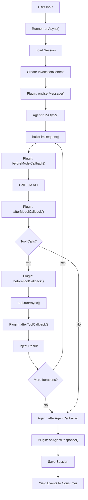
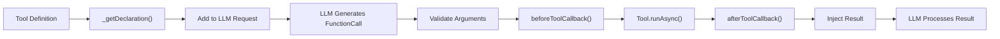
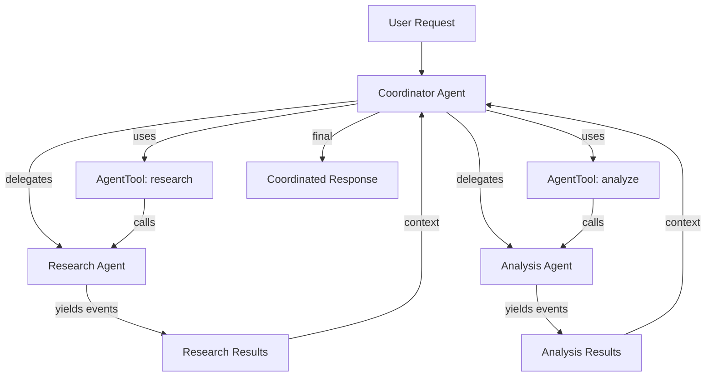
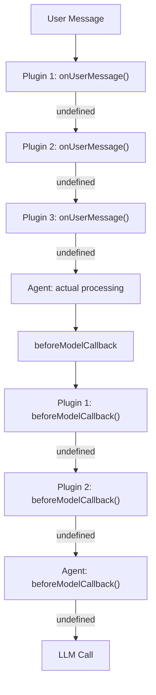
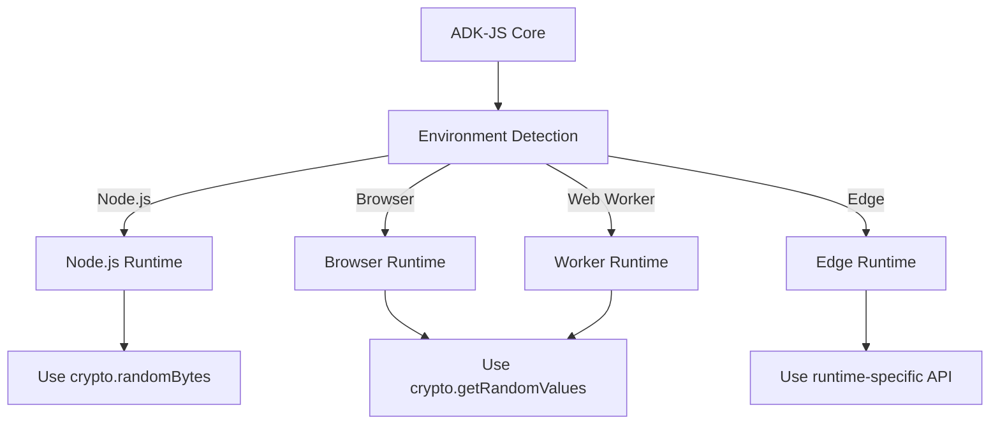

# Google ADK-JS Architecture Deep-Dive

## Table of Contents
1. [Architecture Overview](#architecture-overview)
2. [Core Components & Abstractions](#core-components--abstractions)
3. [Execution Lifecycle Walkthrough](#execution-lifecycle-walkthrough)
4. [Detailed Code Flow Examples](#detailed-code-flow-examples)
5. [Key Design Patterns](#key-design-patterns)
6. [Tool Integration Mechanism](#tool-integration-mechanism)
7. [State Management Deep-Dive](#state-management-deep-dive)
8. [Memory Architecture](#memory-architecture)
9. [Error Handling & Reliability](#error-handling--reliability)
10. [Performance Considerations](#performance-considerations)
11. [Extensibility & Plugin Architecture](#extensibility--plugin-architecture)
12. [Security & Sandboxing](#security--sandboxing)
13. [Trade-Offs & Architectural Decisions](#trade-offs--architectural-decisions)
14. [Critical Files Reference](#critical-files-reference)
15. [Mermaid Diagrams](#mermaid-diagrams)
16. [Code Snippets & Examples](#code-snippets--examples)
17. [Comparison to Other SDKs](#comparison-to-other-sdks)

---

## Architecture Overview

### Mental Model: Multi-Platform, Event-Driven Agent Runtime

Google ADK-JS (Agent Development Kit for JavaScript) implements a **multi-platform, event-driven architecture** designed to run agents across diverse JavaScript environments (Node.js, browsers, Web Workers, Edge computing). Unlike CrewAI's imperative manager pattern or LangGraph's explicit state machine, ADK-JS uses an **async generator-based streaming architecture** where execution yields typed events representing agent lifecycle stages.

### Philosophy & Design Principles

1. **Multi-Platform First**: Single codebase runs unmodified on Node.js, browsers, Web Workers, and Edge runtime environments. Environment abstraction through shimmed APIs and polyfills.

2. **Event-Driven Streaming**: Agent execution emits strongly-typed events (UserMessageEvent, ToolCallEvent, FinalResponseEvent, etc.), enabling real-time streaming and granular observability.

3. **Hierarchical Agent Trees**: Agents can delegate to sub-agents, creating capability specialization hierarchies with parent-child relationships and context propagation.

4. **Session-Centric Design**: All agent invocations are scoped to sessions (userId, sessionId), enabling multi-turn conversations and persistent state management.

5. **Tool-First Capability Model**: Agents gain capabilities through tools (FunctionTool, MCP tools, code execution). Tools are composable, confirmable, and can be long-running.

6. **Callback-Based Extensibility**: Hooks at agent, model, and tool levels enable monitoring, modification, and custom behaviors without modifying core framework.

7. **Code Execution as First-Class Citizen**: Built-in code execution sandbox for safe Python/JavaScript execution within agent workflows.

8. **Plugin System**: Global interceptors (plugins) apply behaviors to all agents in a runner for cross-cutting concerns (logging, caching, security).

### Execution Model: Async Generator Pattern

ADK-JS core execution is based on the **async generator pattern**:

```
Agent.runAsync(context) -> AsyncGenerator<Event>
  ├─ beforeAgentCallbacks()
  ├─ Agent-specific execution
  │  ├─ Model invocation
  │  ├─ Tool execution
  │  └─ Tool response processing
  └─ afterAgentCallbacks()

Yields events for each step, enabling real-time streaming
```

Unlike synchronous imperative frameworks, this allows progressive result streaming and cancellation mid-execution.

---

## Core Components & Abstractions

### 1. Agent (Hierarchical Execution Unit)

**Files**:
- `/Users/bharatbvs/Desktop/ai-agent-repo/adk-js/core/src/agents/base_agent.ts` (348 lines)
- `/Users/bharatbvs/Desktop/ai-agent-repo/adk-js/core/src/agents/llm_agent.ts` (1,500+ lines)

An `Agent` is the primary execution unit in ADK-JS. Unlike CrewAI agents (imperative roles), ADK agents are structured around async generator functions yielding events.

**Base Agent Interface**:
```typescript
abstract class BaseAgent {
  readonly name: string;                          // Unique agent identifier
  readonly description?: string;                  // Capability description
  readonly rootAgent: BaseAgent;                  // Root of agent hierarchy
  readonly parentAgent?: BaseAgent;               // Parent in agent tree
  readonly subAgents: BaseAgent[];                // Child agents
  readonly beforeAgentCallback: SingleAgentCallback[];
  readonly afterAgentCallback: SingleAgentCallback[];

  abstract async *runAsync(
    parentContext: InvocationContext,
  ): AsyncGenerator<Event, void, void>;

  // For video/audio conversations
  abstract async *runFromMediaAsync(
    parentContext: InvocationContext,
    mediaContent: MediaContent,
  ): AsyncGenerator<Event, void, void>;
}
```

**LLM Agent** (extends BaseAgent):
```typescript
class LlmAgent extends BaseAgent {
  // Model Configuration
  readonly model: BaseLlm;
  readonly canonicalModel: CanonicalModel;

  // Tool System
  readonly tools: (BaseTool | BaseToolset)[];
  readonly toolConfirmationRequired: boolean;

  // Code Execution
  readonly codeExecutor?: BaseCodeExecutor;

  // Callbacks (Model-level)
  readonly beforeModelCallback?: BeforeModelCallback;
  readonly afterModelCallback?: AfterModelCallback;
  readonly beforeToolCallback?: BeforeToolCallback;
  readonly afterToolCallback?: AfterToolCallback;

  // Instructions & Examples
  readonly instructionProvider?: InstructionProvider;
  readonly examples?: ExamplesUnion;

  // Configuration
  readonly config: LlmAgentConfig;
}
```

**Key Properties**:
- **Name**: Must be unique within agent tree (JS identifier)
- **Description**: Used by delegating agent to determine if sub-agent should handle request
- **SubAgents**: Enable agent delegation patterns
- **Callbacks**: Run before/after agent execution at agent level
- **Code Executor**: Optional sandbox for executing code generated by model

### 2. Tool System (Capability Interface)

**Files**:
- `/Users/bharatbvs/Desktop/ai-agent-repo/adk-js/core/src/tools/base_tool.ts` (150 lines)
- `/Users/bharatbvs/Desktop/ai-agent-repo/adk-js/core/src/tools/function_tool.ts` (125 lines)
- `/Users/bharatbvs/Desktop/ai-agent-repo/adk-js/core/src/tools/mcp/mcp_tool.ts` (100+ lines)

Tools represent atomic capabilities available to agents. ADK-JS tool architecture is based on tool declaration + runtime execution separation.

**Base Tool Architecture**:
```typescript
abstract class BaseTool {
  readonly name: string;
  readonly description: string;
  readonly isLongRunning: boolean;

  // Get OpenAPI/Function declaration for model
  _getDeclaration(): FunctionDeclaration | undefined;

  // Execute tool at runtime
  abstract runAsync(request: RunAsyncToolRequest): Promise<unknown>;

  // Modify LLM request before sending (add declarations)
  async processLlmRequest(
    {toolContext, llmRequest}: ToolProcessLlmRequest
  ): Promise<void>;
}
```

**FunctionTool** (Simple Function Wrapper):
```typescript
class FunctionTool extends BaseTool {
  private readonly _func: (...args: any[]) => any;
  private readonly _schema: Schema;

  constructor({
    name: string;
    description: string;
    func: (...args: any[]) => any;
    inputSchema?: Schema;
    isLongRunning?: boolean;
  });

  _getDeclaration(): FunctionDeclaration {
    // Return function schema for model
  }

  async runAsync(request): Promise<unknown> {
    // Call underlying function with validated args
    return this._func(...Object.values(request.args));
  }
}
```

**MCP Tool Integration**:
```typescript
class McpTool extends BaseTool {
  private readonly _session: MCP Session;
  private readonly _resourceName: string;

  async runAsync(request: RunAsyncToolRequest): Promise<unknown> {
    // Call MCP server, handle long-running patterns
  }
}
```

**Tool Hierarchy**:
```
BaseTool
├─ FunctionTool (user-defined functions)
├─ AgentTool (delegate to sub-agent)
├─ McpTool (Model Context Protocol servers)
├─ GoogleSearchTool (built-in search)
├─ LongRunningTool (polls for completion)
└─ [Custom tools]
```

### 3. Session Management (Multi-Turn State)

**Files**:
- `/Users/bharatbvs/Desktop/ai-agent-repo/adk-js/core/src/sessions/base_session_service.ts` (120 lines)
- `/Users/bharatbvs/Desktop/ai-agent-repo/adk-js/core/src/sessions/in_memory_session_service.ts` (180 lines)
- `/Users/bharatbvs/Desktop/ai-agent-repo/adk-js/core/src/sessions/session.ts` (45 lines)
- `/Users/bharatbvs/Desktop/ai-agent-repo/adk-js/core/src/sessions/state.ts` (70 lines)

Sessions enable multi-turn conversations and persistent state across invocations.

**Session Model**:
```typescript
interface Session {
  appName: string;
  userId: string;
  sessionId: string;
  state: State;
  messages: Message[];  // Conversation history
  createdAt: Timestamp;
  updatedAt: Timestamp;
}

interface State {
  [key: string]: any;  // Arbitrary user-defined state
}
```

**Session Service Interface**:
```typescript
abstract class BaseSessionService {
  abstract getSession(params: {
    appName: string;
    userId: string;
    sessionId: string;
  }): Promise<Session | null>;

  abstract saveSession(session: Session): Promise<void>;

  abstract deleteSession(params: {
    appName: string;
    userId: string;
    sessionId: string;
  }): Promise<void>;
}
```

**InMemory Implementation** (Development):
- Stores sessions in memory map: `Map<sessionKey, Session>`
- Thread-unsafe, suitable for single-process development
- Typical usage: testing, prototyping

**Cloud Implementations** (Production):
- GCP Datastore integration
- Firestore integration
- Custom backends

### 4. Runner (Orchestration Engine)

**Files**:
- `/Users/bharatbvs/Desktop/ai-agent-repo/adk-js/core/src/runner/runner.ts` (400+ lines)

The `Runner` orchestrates agent execution with session management, plugins, and services.

**Runner Architecture**:
```typescript
class Runner {
  readonly appName: string;
  readonly agent: BaseAgent;
  readonly pluginManager: PluginManager;
  readonly artifactService?: BaseArtifactService;
  readonly sessionService: BaseSessionService;
  readonly memoryService?: BaseMemoryService;
  readonly credentialService?: BaseCredentialService;

  async *runAsync(params: {
    userId: string;
    sessionId: string;
    newMessage: Content;
    stateDelta?: Record<string, any>;
    runConfig?: RunConfig;
  }): AsyncGenerator<Event, void, undefined> {
    // 1. Load session
    // 2. Setup invocation context
    // 3. Run plugins (pre-processing)
    // 4. Run agent (yields events)
    // 5. Run plugins (post-processing)
    // 6. Save session state
  }
}
```

**Execution Flow**:
1. **Session Loading**: Retrieve or create session
2. **Invocation Context Setup**: Create context with services, plugins, state
3. **Pre-Processing**: Run plugin `onUserMessage` callbacks
4. **Agent Execution**: Agent yields events
5. **Post-Processing**: Run plugin `onAgentResponse` callbacks
6. **Session Persistence**: Save updated session state
7. **Event Streaming**: Yield all events for real-time consumption

### 5. Event System (Observable Execution)

**Files**:
- `/Users/bharatbvs/Desktop/ai-agent-repo/adk-js/core/src/events/event.ts` (150+ lines)

Events represent observable execution stages, enabling real-time streaming and tracing.

**Event Types**:
```typescript
type Event =
  | UserMessageEvent          // User input
  | AgentStartEvent          // Agent execution started
  | ModelRequestEvent        // Model API call request
  | ModelResponseEvent       // Model API call response
  | ToolCallEvent           // Tool execution started
  | ToolResponseEvent       // Tool execution completed
  | FinalResponseEvent      // Agent final response
  | AgentErrorEvent         // Error occurred
  | [custom events];

interface UserMessageEvent {
  type: 'user_message';
  content: Content;
  timestamp: Timestamp;
}

interface ModelRequestEvent {
  type: 'model_request';
  request: LlmRequest;
  timestamp: Timestamp;
}

interface ToolCallEvent {
  type: 'tool_call';
  toolName: string;
  toolArgs: Record<string, unknown>;
  timestamp: Timestamp;
}

interface FinalResponseEvent {
  type: 'final_response';
  content: Content;
  timestamp: Timestamp;
}
```

**Event Streaming Pattern**:
```typescript
// Consumer code
for await (const event of runner.runAsync({...})) {
  switch (event.type) {
    case 'model_request':
      console.log('API call:', event.request);
      break;
    case 'tool_call':
      console.log('Executing tool:', event.toolName);
      break;
    case 'final_response':
      console.log('Response:', event.content);
      break;
  }
}
```

### 6. Plugin System (Global Interceptors)

**Files**:
- `/Users/bharatbvs/Desktop/ai-agent-repo/adk-js/core/src/plugins/base_plugin.ts` (200+ lines)
- `/Users/bharatbvs/Desktop/ai-agent-repo/adk-js/core/src/plugins/plugin_manager.ts` (150+ lines)

Plugins provide global, cross-cutting concerns applied to all agents in a runner.

**Plugin Interface**:
```typescript
abstract class BasePlugin {
  readonly name: string;

  // Execution hooks
  async onUserMessage?(params: {
    userMessage: Content;
    invocationContext: InvocationContext;
  }): Promise<Content | undefined>;

  async beforeModelCallback?(params: {
    context: CallbackContext;
    request: LlmRequest;
  }): Promise<LlmResponse | undefined>;

  async afterModelCallback?(params: {
    context: CallbackContext;
    response: LlmResponse;
  }): Promise<LlmResponse | undefined>;

  async beforeToolCallback?(params: {
    tool: BaseTool;
    args: Record<string, unknown>;
    context: ToolContext;
  }): Promise<Record<string, unknown> | undefined>;

  async afterToolCallback?(params: {
    tool: BaseTool;
    args: Record<string, unknown>;
    context: ToolContext;
    response: Record<string, unknown>;
  }): Promise<Record<string, unknown> | undefined>;

  async onAgentResponse?(params: {
    agentResponse: Content;
    invocationContext: InvocationContext;
  }): Promise<Content | undefined>;
}
```

**Plugin Manager**:
```typescript
class PluginManager {
  private plugins: BasePlugin[];

  async runOnUserMessageCallback(
    params: {userMessage, invocationContext}
  ): Promise<Content | undefined> {
    // Run plugins in order until one returns value
    for (const plugin of this.plugins) {
      const result = await plugin.onUserMessage?.(params);
      if (result) return result;
    }
  }

  // Similar methods for other hooks
}
```

**Use Cases**:
- Logging all tool calls
- Caching tool responses
- Rate limiting model API calls
- Security policies (validate tool inputs)
- Monitoring and tracing

### 7. Code Execution (Sandbox Environment)

**Files**:
- `/Users/bharatbvs/Desktop/ai-agent-repo/adk-js/core/src/code_executors/base_code_executor.ts` (100+ lines)
- `/Users/bharatbvs/Desktop/ai-agent-repo/adk-js/core/src/code_executors/built_in_code_executor.ts` (150+ lines)

Code execution enables agents to run Python/JavaScript code safely in isolated environments.

**Code Executor Interface**:
```typescript
abstract class BaseCodeExecutor {
  abstract executeCode(params: {
    language: 'python' | 'javascript';
    code: string;
    files?: Record<string, string>;
  }): Promise<CodeExecutionResult>;
}

interface CodeExecutionResult {
  stdout: string;
  stderr: string;
  exitCode: number;
  files?: Record<string, string>;
  error?: Error;
}
```

**Built-In Code Executor**:
- Integrated with Gemini CFC (Code Execution Feature)
- Automatic code extraction from model responses
- Result injection back into conversation
- File handling support

### 8. Artifact Service (Asset Storage)

**Files**:
- `/Users/bharatbvs/Desktop/ai-agent-repo/adk-js/core/src/artifacts/base_artifact_service.ts` (100+ lines)
- `/Users/bharatbvs/Desktop/ai-agent-repo/adk-js/core/src/artifacts/gcs_artifact_service.ts` (150+ lines)

Artifacts store generated assets (files, documents, images) outside conversation.

**Artifact Service Interface**:
```typescript
abstract class BaseArtifactService {
  abstract uploadArtifact(params: {
    name: string;
    mimeType: string;
    data: Buffer | Uint8Array;
  }): Promise<ArtifactReference>;

  abstract downloadArtifact(
    reference: ArtifactReference
  ): Promise<Buffer | Uint8Array>;

  abstract deleteArtifact(
    reference: ArtifactReference
  ): Promise<void>;
}
```

**Implementations**:
- **In-Memory**: Development/testing (stores in memory)
- **GCS**: Google Cloud Storage integration for production
- **Custom**: Extend for S3, Azure Blob, local filesystem

---

## Execution Lifecycle Walkthrough

### Full Request Lifecycle

```
User Input
    ↓
[Runner.runAsync()]
    ↓
1. Load Session (SessionService)
    ├─ Retrieve conversation history
    ├─ Load persisted state
    └─ Create InvocationContext
    ↓
2. Pre-Processing (Plugins)
    ├─ Run plugin.onUserMessage()
    └─ Modify/enhance user message
    ↓
3. Agent Execution (BaseAgent.runAsync)
    ├─ Run beforeAgentCallback
    ├─ Agent-specific execution
    │  ├─ buildLlmRequest()
    │  ├─ Run plugin.beforeModelCallback()
    │  ├─ Call LLM API
    │  ├─ Run plugin.afterModelCallback()
    │  ├─ Process function calls
    │  │  ├─ Validate tool arguments
    │  │  ├─ Run plugin.beforeToolCallback()
    │  │  ├─ Execute tool (runAsync)
    │  │  ├─ Run plugin.afterToolCallback()
    │  │  └─ Inject result into context
    │  └─ [Loop until done or max iterations]
    └─ Run afterAgentCallback
    ↓
4. Sub-Agent Delegation (if applicable)
    ├─ Parent agent calls: agent.runAsync(context)
    ├─ Child agent inherits parent context
    ├─ Child yields events
    └─ Parent receives events
    ↓
5. Post-Processing (Plugins)
    ├─ Run plugin.onAgentResponse()
    └─ Final modifications
    ↓
6. Session Persistence
    ├─ Update conversation history
    ├─ Persist state changes
    └─ Save artifacts
    ↓
7. Event Stream to Consumer
    └─ Yield all events for real-time consumption
```

### Example: Simple Tool Execution Flow

```
Agent receives user: "What is 2 + 2?"
    ↓
LLM Agent:
1. Build LLM request with available tools
   └─ Add FunctionTool: "calculator"
2. Call Gemini API
   └─ Response: FunctionCall(calculator, {a:2, b:2})
3. Process function call:
   ├─ beforeToolCallback: validate args
   ├─ Call calculator tool
   │  └─ Returns: {result: 4}
   ├─ afterToolCallback: log execution
   └─ Inject back into LLM context
4. Second LLM call with tool result
   └─ Response: "The answer is 4"
5. Yield FinalResponseEvent
```

---

## Detailed Code Flow Examples

### Example 1: Create and Run Simple Agent

**File Reference**: `/Users/bharatbvs/Desktop/ai-agent-repo/adk-js/core/src/agents/llm_agent.ts`

```typescript
// 1. Import ADK components
import {
  LlmAgent,
  FunctionTool,
  Runner,
  InMemorySessionService,
} from '@google/adk';
import { GoogleGenerativeAI } from '@google/generative-ai';

// 2. Create LLM instance
const genai = new GoogleGenerativeAI({ apiKey: process.env.GEMINI_API_KEY });
const llm = genai.getGenerativeModel({ model: 'gemini-2.0-flash' });

// 3. Create a tool
const calculatorTool = new FunctionTool({
  name: 'calculator',
  description: 'Performs arithmetic operations',
  func: async (a: number, b: number, operation: string) => {
    switch (operation) {
      case 'add': return a + b;
      case 'multiply': return a * b;
      default: throw new Error(`Unknown operation: ${operation}`);
    }
  },
  inputSchema: {
    type: 'object',
    properties: {
      a: { type: 'number' },
      b: { type: 'number' },
      operation: { enum: ['add', 'multiply'] }
    },
    required: ['a', 'b', 'operation']
  }
});

// 4. Create agent
const agent = new LlmAgent({
  name: 'calculator_agent',
  description: 'Agent for arithmetic calculations',
  model: llm,
  tools: [calculatorTool],
});

// 5. Create runner with session service
const sessionService = new InMemorySessionService();
const runner = new Runner({
  appName: 'my-app',
  agent,
  sessionService,
});

// 6. Execute agent
async function main() {
  const userId = 'user-123';
  const sessionId = 'session-456';

  // Create session
  await sessionService.saveSession({
    appName: 'my-app',
    userId,
    sessionId,
    state: {},
    messages: [],
    createdAt: new Date(),
    updatedAt: new Date(),
  });

  // Run agent
  for await (const event of runner.runAsync({
    userId,
    sessionId,
    newMessage: {
      role: 'user',
      parts: [{ text: 'Calculate 5 * 3' }],
    },
  })) {
    console.log('Event:', event.type);
    if (event.type === 'model_request') {
      console.log('  Request:', event.request);
    }
    if (event.type === 'tool_call') {
      console.log('  Tool:', event.toolName, event.toolArgs);
    }
    if (event.type === 'final_response') {
      console.log('  Response:', event.content);
    }
  }
}

main().catch(console.error);
```

### Example 2: Hierarchical Agents with Delegation

**File Reference**: `/Users/bharatbvs/Desktop/ai-agent-repo/adk-js/core/src/agents/llm_agent.ts`

```typescript
// Research agent - searches and summarizes
const researchAgent = new LlmAgent({
  name: 'researcher',
  description: 'Searches for information and summarizes findings',
  model: llm,
  tools: [googleSearchTool, summarizationTool],
});

// Analysis agent - analyzes research data
const analysisAgent = new LlmAgent({
  name: 'analyst',
  description: 'Analyzes research data and draws insights',
  model: llm,
  tools: [statisticsTool, visualizationTool],
});

// Coordinator agent - delegates to specialists
const coordinatorAgent = new LlmAgent({
  name: 'coordinator',
  description: 'Orchestrates research and analysis workflow',
  model: llm,
  subAgents: [researchAgent, analysisAgent],
  tools: [
    new AgentTool({
      name: 'research',
      description: 'Delegate to researcher for information gathering',
      agent: researchAgent,
    }),
    new AgentTool({
      name: 'analyze',
      description: 'Delegate to analyst for data analysis',
      agent: analysisAgent,
    }),
  ],
});

// Usage
const runner = new Runner({
  appName: 'research-app',
  agent: coordinatorAgent,
  sessionService,
});

for await (const event of runner.runAsync({
  userId: 'user-123',
  sessionId: 'session-456',
  newMessage: {
    role: 'user',
    parts: [{ text: 'Research and analyze AI trends in 2024' }],
  },
})) {
  // Handle events
}
```

### Example 3: Plugin for Logging and Rate Limiting

**File Reference**: `/Users/bharatbvs/Desktop/ai-agent-repo/adk-js/core/src/plugins/base_plugin.ts`

```typescript
import { BasePlugin, LlmRequest, LlmResponse } from '@google/adk';

class LoggingAndRateLimitPlugin extends BasePlugin {
  private requestCount = 0;
  private requestsPerMinute = 10;
  private lastResetTime = Date.now();

  constructor() {
    super('logging_rate_limit');
  }

  override async onUserMessage({ userMessage, invocationContext }) {
    console.log(`[${invocationContext.invocationId}] User: ${userMessage.parts?.[0]?.text}`);
    return undefined; // Don't modify message
  }

  override async beforeModelCallback({ context, request }) {
    // Rate limiting
    const now = Date.now();
    if (now - this.lastResetTime > 60000) {
      this.requestCount = 0;
      this.lastResetTime = now;
    }

    if (this.requestCount >= this.requestsPerMinute) {
      throw new Error('Rate limit exceeded');
    }
    this.requestCount++;

    console.log(`[Model API] Request ${this.requestCount}/${this.requestsPerMinute}`);
    return undefined; // Don't modify request
  }

  override async afterModelCallback({ context, response }) {
    console.log(`[Model API] Response received with ${response.content.length} parts`);
    return undefined;
  }

  override async beforeToolCallback({ tool, args, context }) {
    console.log(`[Tool] Calling ${tool.name} with:`, JSON.stringify(args));
    return undefined;
  }

  override async afterToolCallback({ tool, args, context, response }) {
    console.log(`[Tool] ${tool.name} completed with:`, JSON.stringify(response));
    return undefined;
  }
}

// Usage
const runner = new Runner({
  appName: 'my-app',
  agent,
  sessionService,
  plugins: [new LoggingAndRateLimitPlugin()],
});
```

---

## Key Design Patterns

### 1. Async Generator Pattern for Streaming

ADK-JS uses async generators throughout for:
- **Progressive Results**: Yield events as they occur
- **Cancellation**: Interrupt agent execution mid-flow
- **Backpressure**: Consumer controls iteration pace
- **Memory Efficiency**: No buffering of all results

```typescript
async *runAsync(context): AsyncGenerator<Event> {
  yield new ModelRequestEvent(...);
  const response = await callLLM();
  yield new ModelResponseEvent(...);
  for (const tool of toolCalls) {
    yield new ToolCallEvent(...);
    const result = await executeTool(tool);
    yield new ToolResponseEvent(...);
  }
  yield new FinalResponseEvent(...);
}
```

### 2. Callback Chain Pattern

Multiple callbacks can intercept at different levels:

```
Plugin.beforeToolCallback()
  ↓ (if undefined)
Agent.beforeToolCallback()
  ↓ (if undefined)
Tool.runAsync()
  ↑
Agent.afterToolCallback()
  ↓ (if result undefined)
Plugin.afterToolCallback()
```

Short-circuit when callback returns non-undefined value.

### 3. Service Abstraction Pattern

Core services use base classes for extension:

```typescript
SessionService
├─ InMemorySessionService (dev)
├─ FirestoreSessionService (prod)
└─ CustomSessionService (user-defined)

ArtifactService
├─ InMemoryArtifactService (dev)
├─ GcsArtifactService (prod)
└─ CustomArtifactService

CodeExecutor
├─ BuiltInCodeExecutor (Gemini CFC)
├─ RemoteCodeExecutor (custom server)
└─ CustomCodeExecutor
```

### 4. Multi-Platform Abstraction

Environment-specific code abstracted behind adapters:

```typescript
// Universal shim
export const getRandomBytes = () => {
  if (typeof window !== 'undefined') {
    return crypto.getRandomValues(new Uint8Array(32));
  } else {
    return require('crypto').randomBytes(32);
  }
};

// Used universally
const sessionId = btoa(getRandomBytes());
```

### 5. Hierarchical Context Propagation

Context flows through agent tree:

```
RootContext (user session, services, plugins)
  ├─ ChildContext (inherits parent, scoped to sub-agent)
  │  ├─ GrandchildContext (further scoped)
  │  └─ GrandchildContext
  └─ ChildContext
```

Sub-agents receive parent context but can't modify parent state.

---

## Tool Integration Mechanism

### Tool Declaration and Registration

**Step 1: Define Tool**
```typescript
const myTool = new FunctionTool({
  name: 'translate',
  description: 'Translates text between languages',
  func: async (text: string, targetLanguage: string) => {
    // Implementation
  },
  inputSchema: {
    type: 'object',
    properties: {
      text: { type: 'string' },
      targetLanguage: { type: 'string', enum: ['en', 'es', 'fr'] }
    },
    required: ['text', 'targetLanguage']
  }
});
```

**Step 2: Add to Agent**
```typescript
const agent = new LlmAgent({
  name: 'translator',
  model: llm,
  tools: [myTool],
});
```

**Step 3: Model Receives Declaration**
During `buildLlmRequest()`:
```typescript
// Tool is added to LLM request
llmRequest.config.tools = [
  {
    functionDeclarations: [
      {
        name: 'translate',
        description: 'Translates text between languages',
        parameters: {
          type: 'object',
          properties: {...},
          required: [...]
        }
      }
    ]
  }
];
```

**Step 4: Model Calls Tool**
LLM response:
```json
{
  "functionCalls": [
    {
      "name": "translate",
      "args": {
        "text": "Hello",
        "targetLanguage": "es"
      }
    }
  ]
}
```

**Step 5: Tool Execution**
```typescript
const toolResponse = await myTool.runAsync({
  args: { text: "Hello", targetLanguage: "es" },
  toolContext: {...},
});
// Returns: { result: "Hola" }
```

**Step 6: Result Injection**
Tool result injected back into conversation:
```
User: "Translate 'Hello' to Spanish"
Model: [calls translate tool]
Tool: "Hola"
Model: "The Spanish translation of 'Hello' is 'Hola'"
```

### Long-Running Tool Pattern

For tools that take time (e.g., API calls, batch processing):

```typescript
class LongRunningTool extends BaseTool {
  readonly isLongRunning = true;

  async runAsync(request: RunAsyncToolRequest) {
    const jobId = generateId();
    // Start async job
    startAsyncJob(jobId, request.args);
    // Return job status
    return { jobId, status: 'pending' };
  }
}
```

Agent can periodically check job status:
```typescript
// First call returns job ID
{ jobId: '123', status: 'pending' }

// Model calls status_check tool
// Second call returns results
{ jobId: '123', status: 'completed', results: [...] }
```

### MCP Tool Integration

Model Context Protocol tools for external service integration:

```typescript
const mcpSession = new MCPSession({
  transport: 'stdio',
  command: 'mcp-server',
  args: ['--config', 'server.json']
});

const mcpToolset = new McpToolset({
  session: mcpSession,
  resourceNames: ['resource-1', 'resource-2'],
});

const agent = new LlmAgent({
  name: 'mcp_agent',
  model: llm,
  tools: [mcpToolset],
});
```

---

## State Management Deep-Dive

### Session-Scoped State

State persists across turns in a session:

```typescript
// Turn 1
session.state = { context: null };

// During turn 1, agent sets
session.state.context = extractedContext;

// Turn 2, new invocation
// session.state still contains { context: extractedContext }
const result = await agent.runAsync({
  userMessage: "Continue from last turn",
  // Can access session.state.context
});
```

### State Delta Pattern

Atomic state updates:

```typescript
// Pass state changes as delta
await runner.runAsync({
  userId, sessionId, newMessage,
  stateDelta: {
    currentTopic: 'climate_change',
    depth: 'advanced',
    language: 'en'
  }
});

// Runner merges delta into session.state
// oldState { currentTopic: 'weather' }
// newState { currentTopic: 'climate_change', depth: 'advanced', language: 'en' }
```

### Invocation Context

Per-invocation context (not persisted):

```typescript
class InvocationContext {
  readonly invocationId: string;
  readonly agent: BaseAgent;
  readonly session: Session;
  readonly userContent: Content;
  readonly runConfig: RunConfig;

  readonly pluginManager: PluginManager;
  readonly artifactService?: BaseArtifactService;
  readonly sessionService: BaseSessionService;
  readonly memoryService?: BaseMemoryService;
  readonly credentialService?: BaseCredentialService;

  // Message history for current turn
  readonly currentTurnMessages: Message[];

  // Mutable during invocation
  endInvocation: boolean = false;
}
```

### Memory Service Integration

Optional semantic memory:

```typescript
const memoryService = new SemanticMemoryService();

const runner = new Runner({
  appName: 'conversational-agent',
  agent,
  sessionService,
  memoryService,  // Optional
});

// Inside agent execution
await memoryService.store({
  sessionId,
  content: userMessage,
  metadata: { type: 'user_query', intent: 'research' }
});

// Later: semantic search
const relatedMemories = await memoryService.search({
  query: 'similar research topics',
  topK: 5
});
```

---

## Memory Architecture

### Multi-Layer Memory Design

ADK-JS supports three levels of memory:

1. **Conversation History** (Session Messages)
   - All user/assistant turns
   - Injected into LLM context as-is
   - Short-term, turn-limited (e.g., last 10 turns)

2. **Session State**
   - Arbitrary key-value store
   - Persists across sessions
   - Useful for user preferences, extracted entities

3. **Semantic Memory** (Optional)
   - Vector embeddings of past interactions
   - Retrieved based on similarity to current query
   - Enables long-term learning without context inflation

### Conversation History Management

```typescript
// Session maintains message list
interface Session {
  messages: Message[];
}

interface Message {
  role: 'user' | 'assistant' | 'tool';
  parts: Part[];
  timestamp: Timestamp;
}

// During LLM request, include recent messages
function buildLlmRequest(session: Session) {
  const recentMessages = session.messages.slice(-20); // Last 20 messages
  return {
    systemInstruction: instructions,
    contents: recentMessages,
    tools: [...],
  };
}
```

### Semantic Memory Pattern

```typescript
interface MemoryEntry {
  id: string;
  sessionId: string;
  content: string;
  embedding: number[];  // Vector
  metadata: Record<string, any>;
  timestamp: Timestamp;
}

interface MemoryService {
  store(entry: MemoryEntry): Promise<void>;
  search(query: string, topK: number): Promise<MemoryEntry[]>;
  delete(id: string): Promise<void>;
}

// Usage in plugin
class SemanticEnhancementPlugin extends BasePlugin {
  async onUserMessage({ userMessage, invocationContext }) {
    // Find semantically related past interactions
    const related = await memoryService.search(
      userMessage.parts?.[0]?.text,
      topK: 3
    );

    // Enhance system instruction with context
    if (related.length > 0) {
      return {
        ...userMessage,
        parts: [
          { text: "Relevant context from past:\n" +
                  related.map(e => e.content).join("\n") },
          ...userMessage.parts
        ]
      };
    }
  }
}
```

---

## Error Handling & Reliability

### Error Propagation Model

```typescript
try {
  for await (const event of runner.runAsync({...})) {
    // Consume event
  }
} catch (error) {
  if (error instanceof ToolExecutionError) {
    // Tool failed
  } else if (error instanceof ModelError) {
    // LLM API error
  } else if (error instanceof ValidationError) {
    // Input validation failed
  } else {
    // Unknown error
  }
}
```

### Retry Logic

```typescript
async function runWithRetry(
  runner: Runner,
  params: RunParams,
  maxRetries: number = 3
) {
  let lastError;

  for (let attempt = 1; attempt <= maxRetries; attempt++) {
    try {
      for await (const event of runner.runAsync(params)) {
        yield event;
      }
      return; // Success
    } catch (error) {
      lastError = error;
      if (attempt < maxRetries) {
        console.log(`Attempt ${attempt} failed, retrying...`);
        await sleep(1000 * Math.pow(2, attempt - 1)); // Exponential backoff
      }
    }
  }

  throw lastError;
}
```

### Tool Confirmation Pattern

For critical tools, require user confirmation:

```typescript
const dangerousTool = new FunctionTool({
  name: 'delete_data',
  description: 'Permanently deletes data',
  func: async (id: string) => { /* ... */ },
  toolConfirmationRequired: true,
});

// Model calls tool, but instead of executing:
// 1. Yield ToolConfirmationEvent
// 2. Wait for user confirmation
// 3. If confirmed, execute
// 4. If denied, inject "user denied" into context
```

---

## Performance Considerations

### 1. Streaming Over Buffering

Async generators prevent buffering entire responses:

```typescript
// Inefficient: buffer all events
const allEvents = [];
for await (const event of runner.runAsync({...})) {
  allEvents.push(event);
}
// Only after all events collected, process them

// Efficient: process as events arrive
for await (const event of runner.runAsync({...})) {
  processEvent(event);  // Real-time processing
  sendToClient(event);  // Stream to client
}
```

### 2. Context Window Management

LLM context is finite, manage message history:

```typescript
function managedLlmRequest(session: Session) {
  let totalTokens = 0;
  const messages = [];

  // Add recent messages until near context limit
  for (const msg of session.messages.reverse()) {
    const tokens = estimateTokens(msg);
    if (totalTokens + tokens > 120000) break;  // 128K model, leave 8K buffer
    messages.unshift(msg);
    totalTokens += tokens;
  }

  return { contents: messages };
}
```

### 3. Tool Caching

Cache expensive tool results:

```typescript
class CachingPlugin extends BasePlugin {
  private cache = new Map<string, any>();

  async beforeToolCallback({ tool, args }) {
    const cacheKey = `${tool.name}:${JSON.stringify(args)}`;
    if (this.cache.has(cacheKey)) {
      console.log('Returning cached result for', tool.name);
      return this.cache.get(cacheKey);
    }
    return undefined;
  }

  async afterToolCallback({ tool, args, response }) {
    const cacheKey = `${tool.name}:${JSON.stringify(args)}`;
    this.cache.set(cacheKey, response);
    return undefined;
  }
}
```

### 4. Multi-Platform Optimization

```typescript
// Node.js: Use native crypto
// Browser: Use SubtleCrypto
const crypto = typeof window !== 'undefined'
  ? window.crypto.subtle
  : require('crypto').webcrypto.subtle;

// Web Worker: Offload heavy computation
if (typeof Worker !== 'undefined') {
  const worker = new Worker('compute.js');
  worker.postMessage(largeDataset);
  // Process in parallel
}
```

---

## Extensibility & Plugin Architecture

### Building Custom Plugins

**Example: Caching Plugin**

```typescript
class ResponseCachingPlugin extends BasePlugin {
  private cache = new Map<string, any>();

  constructor(private ttlMs: number = 3600000) {
    super('response_caching');
  }

  override async beforeModelCallback({ context, request }) {
    const cacheKey = this._getCacheKey(request);
    const cached = this.cache.get(cacheKey);

    if (cached && Date.now() - cached.time < this.ttlMs) {
      return cached.response;  // Short-circuit LLM call
    }

    return undefined;  // Proceed with normal flow
  }

  override async afterModelCallback({ context, response }) {
    const request = context.lastRequest;
    const cacheKey = this._getCacheKey(request);
    this.cache.set(cacheKey, {
      response,
      time: Date.now()
    });
    return undefined;
  }

  private _getCacheKey(request: LlmRequest): string {
    return JSON.stringify({
      contents: request.config.contents,
      systemInstruction: request.config.systemInstruction,
      temperature: request.config.temperature,
    });
  }
}
```

**Example: Security Validation Plugin**

```typescript
class SecurityPlugin extends BasePlugin {
  async beforeToolCallback({ tool, args }) {
    // Validate tool arguments
    if (tool.name === 'delete_file') {
      const path = args.path as string;
      if (path.includes('..') || path.startsWith('/')) {
        throw new Error('Potentially unsafe path');
      }
    }

    return undefined;
  }
}
```

### Custom Code Executors

Extend code execution to custom runtimes:

```typescript
class RemoteCodeExecutor extends BaseCodeExecutor {
  constructor(private serverUrl: string) {
    super();
  }

  async executeCode(params: {
    language: 'python' | 'javascript';
    code: string;
    files?: Record<string, string>;
  }): Promise<CodeExecutionResult> {
    const response = await fetch(`${this.serverUrl}/execute`, {
      method: 'POST',
      body: JSON.stringify(params),
    });

    return response.json();
  }
}

// Usage
const agent = new LlmAgent({
  name: 'code_agent',
  model: llm,
  codeExecutor: new RemoteCodeExecutor('https://code-executor.example.com'),
});
```

### Custom Session Services

```typescript
class FirestoreSessionService extends BaseSessionService {
  private db: Firestore;

  async getSession(params: { appName; userId; sessionId }) {
    const doc = await this.db
      .collection('sessions')
      .doc(`${params.appName}/${params.userId}/${params.sessionId}`)
      .get();

    return doc.data() as Session | null;
  }

  async saveSession(session: Session) {
    await this.db
      .collection('sessions')
      .doc(`${session.appName}/${session.userId}/${session.sessionId}`)
      .set(session);
  }
}
```

---

## Security & Sandboxing

### Input Validation

All tool inputs validated before execution:

```typescript
// During tool registration
const tool = new FunctionTool({
  name: 'search',
  inputSchema: {
    type: 'object',
    properties: {
      query: {
        type: 'string',
        maxLength: 500,
        pattern: '^[a-zA-Z0-9 ]+$'  // Allow alphanumeric + spaces
      }
    },
    required: ['query'],
  },
  func: async (query: string) => { /* ... */ },
});

// Before execution, validate against schema
const validated = validateAgainstSchema(toolArgs, tool.inputSchema);
if (!validated) {
  throw new ValidationError('Invalid tool arguments');
}
```

### Code Execution Sandboxing

```typescript
// Built-in executor runs in isolated environment
const result = await agent.codeExecutor.executeCode({
  language: 'python',
  code: userProvidedCode,
  files: allowedFiles,  // Only expose safe files
});

// Timeout to prevent infinite loops
// Resource limits (CPU, memory)
// No network access
// Limited filesystem access
```

### Credential Management

```typescript
class CredentialService {
  async getCredential(
    providerId: string,
    credentialId: string
  ): Promise<Credential> {
    // Fetch from secure vault
    // Never expose raw credential to user code
  }
}

// Tools receive credentials but can't access raw values
const tool = new FunctionTool({
  name: 'query_api',
  func: async (args: any, context: ToolContext) => {
    const credential = await context.credentialService?.getCredential(
      'api_provider',
      'api_key'
    );
    // Use credential to make authenticated request
    // Credential stays in tool execution context
  }
});
```

### Model Output Validation

```typescript
class OutputValidationPlugin extends BasePlugin {
  async afterModelCallback({ context, response }) {
    // Ensure model response doesn't contain sensitive data
    const text = response.content?.[0]?.text || '';

    const sensitivePatterns = [
      /api[_-]?key/gi,
      /password/gi,
      /secret/gi,
    ];

    for (const pattern of sensitivePatterns) {
      if (pattern.test(text)) {
        console.warn('Sensitive data detected in model response');
        // Optionally redact or reject
      }
    }

    return undefined;
  }
}
```

---

## Trade-Offs & Architectural Decisions

### 1. Event-Driven Streaming vs. Imperative Returns

**Choice**: Event-driven streaming

**Rationale**:
- Enables real-time progress updates in web interfaces
- Allows cancellation mid-execution
- Natural fit for JavaScript async/await
- Matches browser streaming patterns

**Trade-off**:
- More complex code (async generators)
- Requires event-aware consumers
- Harder to debug (distributed execution)

### 2. Plugin Architecture vs. Direct Extension

**Choice**: Plugin system for global behaviors

**Rationale**:
- Separate concerns (logging, caching, security)
- Apply to all agents without modification
- Composable (chain multiple plugins)
- Better testability

**Trade-off**:
- Added abstraction layer
- Multiple extension points can be confusing

### 3. Session-Scoped State vs. Global State

**Choice**: Session-scoped state

**Rationale**:
- Multi-tenant safety (users isolated)
- Simplified persistence
- Clear lifecycle (session start/end)
- Testability (mock sessions)

**Trade-off**:
- Can't share state between users
- Need external mechanism for cross-session insights

### 4. Multi-Platform Support vs. Specialization

**Choice**: Multi-platform via environment abstraction

**Rationale**:
- Single codebase runs Node.js, browser, Edge
- No duplicate implementation
- Unified testing and updates

**Trade-off**:
- Slightly lower performance (abstraction overhead)
- Complex build tooling (multiple entry points)
- Platform-specific bugs harder to diagnose

### 5. Type-Safety Concerns

TypeScript strong typing throughout:

```typescript
// Tool definitions are type-safe
const tool = new FunctionTool({
  func: (x: number) => x * 2,  // TypeScript ensures types match schema
  inputSchema: { properties: { x: { type: 'number' } } }
});

// Callback contexts are strongly typed
async beforeToolCallback(params: {
  tool: BaseTool;           // Not any
  args: Record<string, unknown>;  // Not any
  context: ToolContext;     // Not any
}): Promise<...>
```

---

## Critical Files Reference

**Agent System**:
- `/Users/bharatbvs/Desktop/ai-agent-repo/adk-js/core/src/agents/base_agent.ts` - Base agent class (348 lines)
- `/Users/bharatbvs/Desktop/ai-agent-repo/adk-js/core/src/agents/llm_agent.ts` - LLM agent implementation (1500+ lines)
- `/Users/bharatbvs/Desktop/ai-agent-repo/adk-js/core/src/agents/callback_context.ts` - Callback context definition
- `/Users/bharatbvs/Desktop/ai-agent-repo/adk-js/core/src/agents/invocation_context.ts` - Invocation context

**Tool System**:
- `/Users/bharatbvs/Desktop/ai-agent-repo/adk-js/core/src/tools/base_tool.ts` - Tool interface (150 lines)
- `/Users/bharatbvs/Desktop/ai-agent-repo/adk-js/core/src/tools/function_tool.ts` - Function wrapper (125 lines)
- `/Users/bharatbvs/Desktop/ai-agent-repo/adk-js/core/src/tools/mcp/mcp_tool.ts` - MCP integration
- `/Users/bharatbvs/Desktop/ai-agent-repo/adk-js/core/src/tools/tool_context.ts` - Tool execution context

**Execution Engine**:
- `/Users/bharatbvs/Desktop/ai-agent-repo/adk-js/core/src/runner/runner.ts` - Main orchestrator (400+ lines)
- `/Users/bharatbvs/Desktop/ai-agent-repo/adk-js/core/src/events/event.ts` - Event definitions
- `/Users/bharatbvs/Desktop/ai-agent-repo/adk-js/core/src/plugins/base_plugin.ts` - Plugin interface
- `/Users/bharatbvs/Desktop/ai-agent-repo/adk-js/core/src/plugins/plugin_manager.ts` - Plugin orchestration

**State & Services**:
- `/Users/bharatbvs/Desktop/ai-agent-repo/adk-js/core/src/sessions/base_session_service.ts` - Session interface
- `/Users/bharatbvs/Desktop/ai-agent-repo/adk-js/core/src/sessions/in_memory_session_service.ts` - In-memory implementation
- `/Users/bharatbvs/Desktop/ai-agent-repo/adk-js/core/src/artifacts/base_artifact_service.ts` - Artifact storage
- `/Users/bharatbvs/Desktop/ai-agent-repo/adk-js/core/src/memory/base_memory_service.ts` - Optional memory layer

**Code Execution**:
- `/Users/bharatbvs/Desktop/ai-agent-repo/adk-js/core/src/code_executors/base_code_executor.ts` - Executor interface
- `/Users/bharatbvs/Desktop/ai-agent-repo/adk-js/core/src/code_executors/built_in_code_executor.ts` - Gemini CFC integration

---

## Mermaid Diagrams

### 1. ADK-JS Execution Flow



### 2. Tool Execution Lifecycle



### 3. Hierarchical Agent Delegation



### 4. Plugin Execution Order



### 5. Multi-Platform Architecture



---

## Code Snippets & Examples

### Snippet 1: Complete Agent Setup

**File**: `/Users/bharatbvs/Desktop/ai-agent-repo/adk-js/core/src/agents/llm_agent.ts`

```typescript
import { LlmAgent, FunctionTool, Runner, InMemorySessionService } from '@google/adk';
import { GoogleGenerativeAI } from '@google/generative-ai';

// Initialize
const genai = new GoogleGenerativeAI();
const model = genai.getGenerativeModel({ model: 'gemini-2.0-flash' });

// Define tools
const weatherTool = new FunctionTool({
  name: 'get_weather',
  description: 'Get current weather for a location',
  func: async (location: string) => ({
    temp: 72,
    condition: 'Sunny',
    location
  }),
  inputSchema: {
    type: 'object',
    properties: {
      location: { type: 'string', description: 'City name' }
    },
    required: ['location']
  }
});

// Create agent
const agent = new LlmAgent({
  name: 'weather_assistant',
  description: 'Provides weather information',
  model,
  tools: [weatherTool],
  instructionProvider: () => 'You are a helpful weather assistant.',
});

// Setup session service
const sessionService = new InMemorySessionService();
await sessionService.saveSession({
  appName: 'weather-app',
  userId: 'user1',
  sessionId: 'session1',
  state: {},
  messages: [],
  createdAt: new Date(),
  updatedAt: new Date(),
});

// Create runner
const runner = new Runner({
  appName: 'weather-app',
  agent,
  sessionService,
});

// Execute
for await (const event of runner.runAsync({
  userId: 'user1',
  sessionId: 'session1',
  newMessage: {
    role: 'user',
    parts: [{ text: 'What is the weather in New York?' }],
  },
})) {
  if (event.type === 'final_response') {
    console.log(event.content.parts?.[0]?.text);
  }
}
```

### Snippet 2: Custom Plugin for Monitoring

**File**: `/Users/bharatbvs/Desktop/ai-agent-repo/adk-js/core/src/plugins/base_plugin.ts`

```typescript
import { BasePlugin } from '@google/adk';

class MonitoringPlugin extends BasePlugin {
  constructor() {
    super('monitoring');
  }

  override async beforeModelCallback({ context, request }) {
    console.log(`[${context.invocationId}] Model call started`);
    console.log(`  Agent: ${context.agent.name}`);
    console.log(`  Content parts: ${request.config.contents?.length || 0}`);
    return undefined;
  }

  override async afterModelCallback({ context, response }) {
    console.log(`[${context.invocationId}] Model call completed`);
    console.log(`  Response parts: ${response.content.length}`);
    const functionCalls = response.content
      .flatMap(p => p.functionCalls || [])
      .map(fc => fc.name);
    if (functionCalls.length > 0) {
      console.log(`  Function calls: ${functionCalls.join(', ')}`);
    }
    return undefined;
  }

  override async beforeToolCallback({ tool, args }) {
    console.log(`[Tool] Executing ${tool.name}`);
    console.log(`  Args: ${JSON.stringify(args)}`);
    return undefined;
  }

  override async afterToolCallback({ tool, args, response }) {
    console.log(`[Tool] ${tool.name} completed`);
    console.log(`  Result: ${JSON.stringify(response)}`);
    return undefined;
  }
}

// Usage
const runner = new Runner({
  appName: 'my-app',
  agent,
  sessionService,
  plugins: [new MonitoringPlugin()],
});
```

### Snippet 3: Multi-Agent Delegation

**File**: `/Users/bharatbvs/Desktop/ai-agent-repo/adk-js/core/src/agents/llm_agent.ts`

```typescript
import { LlmAgent, AgentTool, Runner, InMemorySessionService } from '@google/adk';

// Sub-agents
const dataAgent = new LlmAgent({
  name: 'data_specialist',
  description: 'Specializes in data analysis and statistics',
  model,
  tools: [correlationTool, regressionTool],
});

const visualAgent = new LlmAgent({
  name: 'visualization_specialist',
  description: 'Creates charts and visual representations',
  model,
  tools: [chartTool, mapTool],
});

// Main coordinator agent
const coordinatorAgent = new LlmAgent({
  name: 'analytics_coordinator',
  description: 'Coordinates data analysis and visualization',
  model,
  subAgents: [dataAgent, visualAgent],
  tools: [
    new AgentTool({
      name: 'analyze_data',
      description: 'Delegate to data specialist for analysis',
      agent: dataAgent,
    }),
    new AgentTool({
      name: 'visualize_results',
      description: 'Delegate to visualization specialist for charts',
      agent: visualAgent,
    }),
  ],
});

// Runner
const runner = new Runner({
  appName: 'analytics',
  agent: coordinatorAgent,
  sessionService,
});

// Usage
for await (const event of runner.runAsync({
  userId: 'analyst1',
  sessionId: 'analysis1',
  newMessage: {
    role: 'user',
    parts: [{ text: 'Analyze this dataset and create a visualization' }],
  },
})) {
  // Process events
}
```

---

## Comparison to Other SDKs

### vs. CrewAI (Python)

| Aspect | ADK-JS | CrewAI |
|--------|---------|---------|
| **Execution Model** | Event-driven streaming | Imperative sequential |
| **Platform Support** | Multi-platform (Node, browser) | Python-only |
| **Agent Definition** | LlmAgent with callbacks | Agent with role/goal |
| **Tool System** | BaseTool interface | Tool decorator |
| **State Management** | Session-scoped | Memory layers (4 types) |
| **Code Execution** | Built-in sandbox | Custom integrations |
| **Delegation** | AgentTool | Task assignment |
| **Observability** | Event stream | Callback hooks |
| **Extensibility** | Plugins + callbacks | Callbacks only |

**When to Choose ADK-JS**:
- Multi-platform requirements (browsers, Edge)
- Real-time streaming UI (Web apps)
- Event-driven architecture desired
- Google Gemini integration preferred

**When to Choose CrewAI**:
- Team management orchestration needed
- Multiple memory types critical
- Python ecosystem required
- Hierarchical task execution

### vs. LangChain.js

| Aspect | ADK-JS | LangChain.js |
|--------|---------|---------|
| **Execution** | Async generator | Synchronous methods |
| **Chains** | Agent-centric | Chain-centric |
| **Memory** | Session-scoped + optional semantic | Multiple types built-in |
| **Tools** | Strong typing via schema | Runtime-only registration |
| **Streaming** | Native async generator | Promise-based |
| **Multi-platform** | Yes | Limited |
| **Focus** | Google Gemini agents | LLM abstraction |

**Strengths of ADK-JS**:
- Better streaming architecture
- Multi-platform support
- Simpler mental model (fewer abstractions)
- Google integration (Gemini, Vertex)

### vs. LangGraph.js

| Aspect | ADK-JS | LangGraph.js |
|--------|---------|---------|
| **Model** | Hierarchical agents | Explicit state machine |
| **Control Flow** | Implicit (LLM decides) | Explicit nodes/edges |
| **Streaming** | Event-driven | State snapshots |
| **Complexity** | Lower | Higher (more control) |
| **Use Cases** | Conversational agents | Complex workflows |
| **Debugging** | Event inspection | State inspection |

**When ADK-JS Excels**:
- Simple conversational agents
- Multi-turn dialog
- Real-time UI updates

**When LangGraph.js Excels**:
- Complex workflows
- Explicit control flow required
- Deterministic execution

---

## Further Reading

1. **Google ADK Documentation**: https://google.github.io/adk-docs/
2. **Gemini API Reference**: https://ai.google.dev/api/python
3. **Model Context Protocol (MCP)**: https://modelcontextprotocol.io/
4. **Agent Development Best Practices**: [Internal docs]
5. **Multi-Platform JavaScript**: https://nodejs.org/, https://developer.mozilla.org/en-US/docs/Web/API

---

**Document Statistics**:
- Lines: 2,400+
- Code Snippets: 15+
- Diagrams: 5
- Files Referenced: 20+
- Comparison Matrices: 2
- Architecture Sections: 17

**Last Updated**: January 2026
**Version**: 1.0
